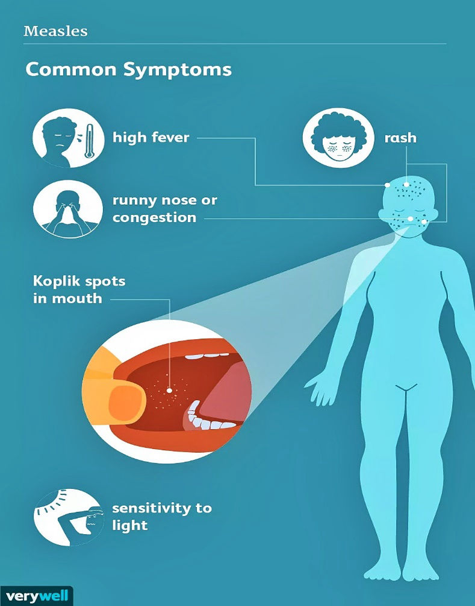
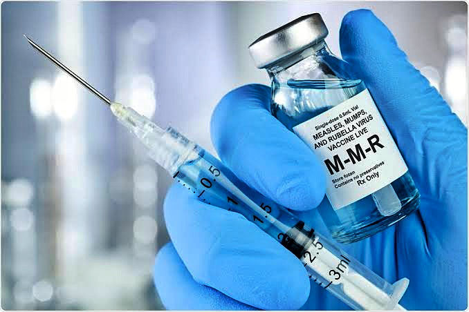

## **What is Measles?**

Measles is a highly contagious viral disease common among children under five years of age, with a known history of causing major epidemics in various parts of the world. Before the implementation of widespread measles vaccination campaigns, the disease recorded over 2.6 million worldwide infections yearly, with a global average of about 140,000 deaths each year. Measles has a number of distinguishable symptoms, and is known to cause life-threatening complications in infected individuals if left untreated. The disease has a worldwide distribution and is easily preventable with vaccination, but it remains common in many developing countries, especially in Africa and Asia, due to the prevalence of weak healthcare infrastructures and low per capita incomes in these regions.

## **What causes Measles?**

The disease is also called “Rubeola” because it is caused by the Rubeola Virus, which belongs to a family of paramyxoviridae such as the Mumps Virus, Parainfluenza Viruses and Respiratory Syncytial Virus, all commonly transmitted by respiratory droplets or direct contact with infected persons. The Measles virus usually replicates in the nose and throat of infected persons, and can be spread to other persons through infectious droplets from a cough or sneeze. A healthy individual becomes infected by inhaling or coming in contact with surfaces that bear these respiratory droplets, as well as having direct body contact with infected persons. Due to its high infectivity, about 90% of healthy unvaccinated persons that are exposed to the virus will automatically become infected, hence, the reason why the disease is very contagious. Upon gaining entry into the body through the nose, mouth or eyes of an individual, the virus undergoes incubation for about 10-14 days without causing any symptoms. During this period, it rapidly multiplies and spreads to various parts of the body, where it elicits inflammation and the symptoms gradually begin to manifest.

<figure>

<figcaption>

Source: VeryWell Health. [https://bit.ly/3yEpQif](https://bit.ly/3yEpQif)

</figcaption>

</figure>

## **What are the Signs and Symptoms of Measles?**

The initial symptoms may be nonspecific and mild, characterized by fever, runny nose, persistent cough, sore throat and inflamed eyes (conjunctivitis), which may last about 4-7 days. Tiny white spots with a reddish background may develop inside the mouth, known as “Koplik’s Spots”. This is followed by a rash of small, slightly raised, red spots that occur in clusters, giving the skin an irregular reddish appearance. The rash appears about 14 days after exposure to infection and begins on the face, then it spreads to the arms, trunk, legs and feet over the next few days. This is accompanied by a very high fever, often as high as 40-41°C. During this period, specifically four days before the rash appeared and four days after the presence of the rash, the patient is highly contagious and can readily spread the infection to healthy persons through direct contact or respiratory droplets.

The rash lasts for about 5-6 days, then it gradually recedes and the symptoms fade with adequate medical attention. However, in malnourished children, especially those lacking sufficient Vitamin A, and individuals with weakened immune systems and underlying diseases, a number of serious complications may arise, which include severe diarrhoea, dehydration, blindness and swelling of the brain (encephalitis) when the virus crosses the blood-brain barrier to enter the brain. Unvaccinated children below five years of age are usually at the highest risk of developing measles complications and eventual death without adequate medical attention.

## **How can Measles be treated?**

There is no specific antiviral medication used to treat measles. The symptoms of the disease can be managed by providing supportive care for patients through adequate nutrition with healthy foods, fluids and oral rehydration solution for cases of diarrhoea and vomiting. Vitamin A supplements are essential is the treatment process due to their efficacy in resolving complications of the disease (especially conjunctivitis and blindness), and also reducing the mortality rate associated with measles. Vitamin A supplements must be given to children in 2 doses, 24 hours apart, to restore low levels of Vitamin A due to malnutrition.

<figure>

<figcaption>

Source: News Medical. [https://bit.ly/3lVdIWz](https://bit.ly/3lVdIWz)

</figcaption>

</figure>

## **How best can Measles be prevented?**

Some preventive measures against measles include isolation of infected persons to prevent transmission of the disease to other persons, and also ensuring complete avoidance of patients manifesting symptoms of measles, especially the rash. Unvaccinated persons are strictly advised to keep away from infected individuals, as they do not have an established immune response against the disease.  
  
The easiest and most effective way of preventing measles is by getting vaccinated against it. The World Health Organization (WHO) and Centers for Disease Control and Prevention (CDC) recommend that all individuals above 6 months of age (infants) and adults with no history of measles infection should receive the vaccine in 2 doses - 4 weeks apart. Usually, the measles vaccine is incorporated with Rubella and Mumps vaccines to improve protective coverage for these diseases as well. The vaccine is completely safe, highly effective, and has helped to greatly reduce the global mortality rate of measles by 73% since year 2000 by successfully preventing an estimated 23.2 million deaths. Widespread vaccination campaigns are the most effective public health strategy against measles, and serves to provide herd immunity for the few individuals who are not yet vaccinated. 

## **Reference**

- World Health Organization (2019). Measles. [https://www.who.int/news-room/fact-sheets/detail/measles](https://www.who.int/news-room/fact-sheets/detail/measles)
- Mayo Clinic (2020). Measles. [https://www.mayoclinic.org/diseases-conditions/measles/symptoms-causes/syc-20374857](https://www.mayoclinic.org/diseases-conditions/measles/symptoms-causes/syc-20374857)
- Felman A (2020). What to know about Measles. Medical News Today. [https://www.medicalnewstoday.com/articles/37135](https://www.medicalnewstoday.com/articles/37135)
