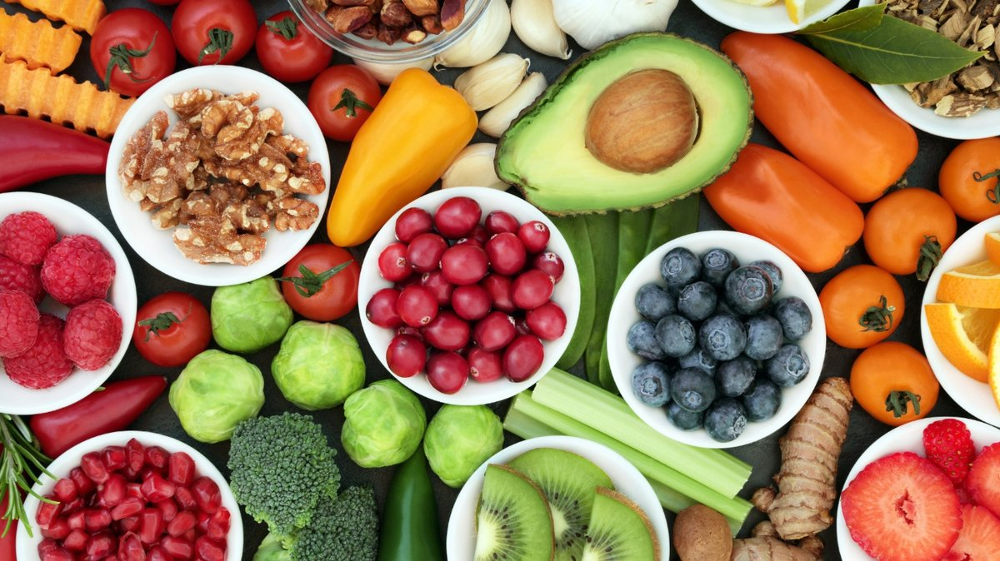

Over the past few decades, the way we eat has changed dramatically.

<h3>U nhealthy diets are among the leading risk factors contributing to non-communicable diseases . Over 35 million cardiovascular deaths are estimated to occur globally by 2050 .</h3>

In today’s world, busy lifestyles and convenience have influenced daily dietary choices. Foods like packaged snacks, sugary drinks, and processed meals, that were once occasional meals, have gradually become everyday staples. These foods are made to be convenient, affordable, and attractive. However, as their inclusion in diets grows, scientists and public health experts are raising concerns: *Are we trading convenience today for health problems tomorrow?*

These concerns stem from the fact that diet really influences our health. According to the [World Health Organization](https://www.who.int/activities/preventing-noncommunicable-diseases) (WHO), unhealthy diets are among the leading risk factors contributing to non-communicable diseases such as cardiovascular diseases, diabetes, and cancer. One category of food which has gained increasing attention is ultra-processed foods (UPFs).

## **What ****Exactly ****Are Ultra-Processed Foods?**

Processing has existed for centuries and includes simple methods such as cooking, drying, fermenting, or freezing foods to improve safety and shelf life.

However, ultra-processed foods are different. They are industrially manufactured products that often contain ingredients and additives not commonly found in home kitchens, including artificial flavors, sweeteners, emulsifiers, and preservatives. They are usually designed to be ready-to-eat, highly appealing, and long-lasting.

Examples include:

- Soft drinks and sugary beverages
- Packaged snacks
- Instant noodles
- Cakes and biscuits
- Processed meats, like in pies and fried pastries
- Some fast foods and ready-made meals

The real worry is not just that these foods are processed; it's also that more UPFs are replacing healthier, minimally processed options in many people's diets.

## **Why Are Ultra-Processed Foods Becoming So Common?**

The rise of UPFs is not accidental. Modern lifestyles have created a demand for foods that are:

- Quick to prepare
- Affordable
- Easily available
- Convenient for busy schedules

Food industries have also created highly attractive products by combining sugar, salt, fats, flavors, and textures. Consequently, many people often eat these foods without realizing how much they've replaced traditional, whole foods like fruits, vegetables, legumes, and grains.

*Natural and super food options for good health. Source: Getty Images*

## **The Hidden Cost of Convenience****: How Ultra-Processed Foods Affect the Body**

Concerns about UPFs go beyond what is seen on the packaging. Many of these foods are high in added sugars, trans and saturated fats, sodium, and low in fiber and other important nutrients. These diets have been associated with increased risks of several chronic conditions, including obesity, type 2 diabetes, and cardiovascular diseases;

### **Weight Gain and Obesity**

Many ultra-processed foods are high in energy and easy to consume in large amounts. Their combination of refined carbohydrates, unhealthy fats, and appealing flavors can encourage overeating, disrupting the body’s ability to regulate hunger and fullness. Over time, excessive calorie intake can contribute to weight gain and obesity.

### **Increased Risk of Type 2 Diabetes**

Frequent consumption of foods high in added sugars and refined carbohydrates can contribute to repeated spikes in blood glucose levels. Over time, this may affect how the body responds to insulin, increasing the risk of insulin resistance and type 2 diabetes.

### **Heart Disease and Metabolic Health**

[Cardiovascular diseases](https://www.who.int/news-room/fact-sheets/detail/cardiovascular-diseases-(cvds)) (CVDs), especially heart attack and stroke, are the leading cause of death globally. Projections from the [Global Burden of Disease (GBD) 2019 study](https://doi.org/10.1093/eurjpc/zwae281) estimate that over 35 million cardiovascular deaths will occur in 2050, from 20.5 million in 2025. High intake of foods rich in sodium, unhealthy fats, and added sugars can contribute to high blood pressure and abnormal cholesterol levels, which are risk factors for CVDs.

## **Are All Processed Foods Unhealthy, and How Can You Maintain a Balance?**

The discussion on ultra-processed foods points to the need to maintain balance. Not all processed foods are harmful; some still offer essential nutrients. The main concern is when ultra-processed foods dominate diets and displace healthier choices. The aim is not perfection but to encourage more informed decision-making when choosing your diet;

- Choose whole or minimally processed foods more often
- Increase intake of fruits, vegetables, and fiber-rich foods
- Drink more water instead of sugary beverages
- Prepare meals at home when possible
- Read food labels and understand ingredients before consumption

## **Important Takeaway**

Food is one of the bases of long-term health and well-being. Ultra-processed foods may offer convenience, but dependence on them raises the risk of preventable diseases. Remember that the choices you make on your plate today can influence your health tomorrow. Protecting health is not about treating disease when it appears. It is about ensuring the choices you make daily keep you healthy and prevent the onset of disease.

---

## **References**

- NHS (2024, August 15). *Processed foods*. nhs.uk. [https://www.nhs.uk/live-well/eat-well/how-to-eat-a-balanced-diet/what-are-processed-foods/](https://www.nhs.uk/live-well/eat-well/how-to-eat-a-balanced-diet/what-are-processed-foods/)
- World Health Organization: WHO. (2025, July 31). *Cardiovascular diseases (CVDs)*. [https://www.who.int/news-room/fact-sheets/detail/cardiovascular-diseases-(cvds)](https://www.who.int/news-room/fact-sheets/detail/cardiovascular-diseases-(cvds))
- Chong, B., Jayabaskaran, J., Jauhari, S. M., Chan, S. P., Goh, R., Kueh, M. T. W., Li, H., Chin, Y. H., Kong, G., Anand, V. V., Wang, J., Muthiah, M., Jain, V., Mehta, A., Lim, S. L., Foo, R., Figtree, G. A., Nicholls, S. J., Mamas, M. A., . . . Chan, M. Y. (2024). Global burden of cardiovascular diseases: projections from 2025 to 2050. *European Journal of Preventive Cardiology*, *32*(11), 1001–1015. [https://doi.org/10.1093/eurjpc/zwae281](https://doi.org/10.1093/eurjpc/zwae281)
- *Preventing noncommunicable diseases*. (2026, June 3). [https://www.who.int/activities/preventing-noncommunicable-diseases](https://www.who.int/activities/preventing-noncommunicable-diseases)
- s