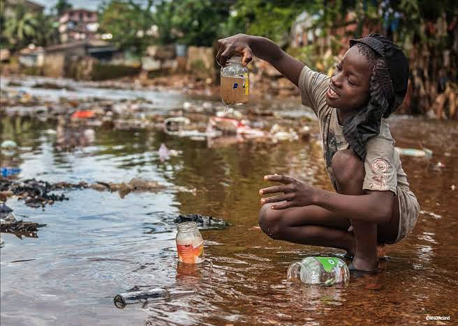
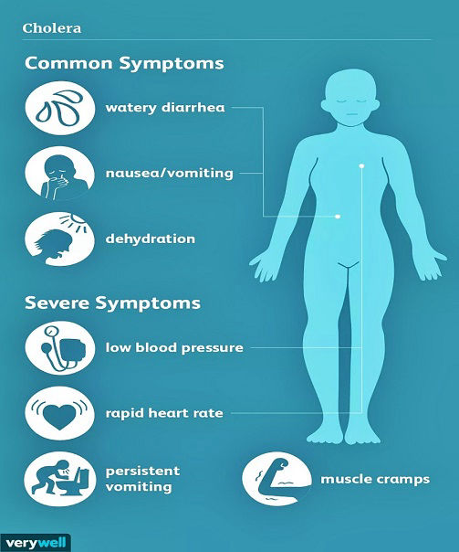

## **Overview of Cholera**

Cholera is an infectious disease among humans, characterized by acute diarrheal symptoms and is regarded as an infectious disease of poverty due to its prevalence in regions that are low-resourced with poor sanitary conditions. Every year, over 2.9 million cases occur around the world, causing around 95,000 deaths annually. Although the disease is cosmopolitan, it is highly endemic in Africa, a continent that is home to numerous underdeveloped countries where resources are limited and the infection prevention and control measures are inadequate.  
  
Globally, cholera is considered as one of the most rapidly fatal illnesses ever known, as it causes severe diarrhea and vomiting, leading to rapid dehydration, shock and possible death.

## **What causes Cholera?**

The disease is caused by a specific bacterium called Vibrio cholerae, which invades the human intestine and produces a powerful toxin that causes excessive loss of water and electrolytes from the body, leading to the production of massive, loose diarrheal stools popularly referred to as ‘rice-water stool’. It may be accompanied by repeated bouts of vomiting. This causes severe dehydration and if left untreated, can be fatal to the patient in a matter of hours. The causative bacterium is found in food and water sources that have been contaminated by the feces of an infected person, hence, transmission of the disease is high in places with poor water supply and improper sanitary conditions. Water sources like ponds, rivers, streams, lakes and tap water are known to harbor the bacteria and can be transmitted to various persons through food and drinks gotten from these water sources, vegetables grown with infected human waste as fertilizer, as well as the consumption of raw or undercooked fish and other marine foods gotten from polluted water bodies.

<figure>

<figcaption>

Source: UN Water. [https://bit.ly/3gxxjsR](https://bit.ly/3gxxjsR)

</figcaption>

</figure>

## **What are the Signs and Symptoms of Cholera?**

Upon entry of the bacteria into the intestines, the symptoms of cholera can begin within a few hours to about 5 days after infection. Sometimes, infected persons may experience mild or no symptoms, but they are capable of spreading the infection to others through improper disposal of their fecal matter. However, when the infectious dose of bacteria cells is high, infected persons will experience severe symptoms within a few hours or days, some of which include sudden, massive diarrhea characterized by frequent production of very loose stools every hour or so.

This is accompanied by nausea and vomiting, which further compounds the severity of dehydration, as a lot of body fluids and electrolytes are lost in the process. The possible fatality of cholera depends on the level of dehydration, as it leads to dryness of skin, extreme thirst, sunken eyes and dry mucous membranes, low blood pressure, and electrolyte imbalance, which gives rise to tachycardia (rapid heart rate), muscle cramps and shock. If left untreated, such severe dehydration can lead to death in a matter of hours.

<figure>

<figcaption>

Source: Smithsonian Magazine. [https://bit.ly/3q2onyy](https://bit.ly/3q2onyy).

</figcaption>

</figure>

##   
**How is Cholera diagnosed?**

Due to the sudden onset of symptoms in severe cases of cholera infection, diagnosis is usually based on the characteristic signs and symptoms of the disease. However, in individuals where the infection is mild, diagnosis is made by taking a stool sample from the infected patient’s excreta or taking a rectal swab and carrying out a laboratory analysis to detect the Vibrio cholerae bacteria. 

## **What is the level of Cholera burden in Africa?**

Cholera is an infectious disease with worldwide geographical distribution, however, it has a much higher prevalence of cases and mortality rates in the African continent. This is due to the fact that many African countries lack access to clean water supply and practice poor sanitary measures, which is a common situation in most rural, underdeveloped areas. As of 2017, about 34 countries worldwide experienced cholera outbreaks, of which the majority were African countries like Somalia, Ethiopia, Democratic Republic of Congo, Nigeria, Zambia and South Sudan. A total of about 1,227,391 cholera cases were recorded worldwide, of which 179,835 of the cases were from Africa. In terms of mortality, about 57% of the worldwide deaths from cholera occurred in African countries.

Reservoirs of the cholera bacteria, mainly contaminated marine environments like shallow springs, streams, river brooks, lagoons, heavily polluted water surfaces, wetlands, groundwater systems and sewage disposal systems, are quite prevalent in these areas because of the poor sanitary practices. Although the cholera outbreaks occur in all seasons, most of the cases in these regions are reported during the onset of the rainy and dry seasons. These findings highlight the fact that in order to tackle cholera outbreaks effectively, more infection prevention and control measures need to be channeled to regions of higher prevalence, especially in the African continent.

## **How can Cholera be treated?**

Upon infection, the most important thing to do is to ensure immediate replacement of the body fluids and electrolytes lost through repeated diarrhea. Cholera patients are treated with Oral Rehydration Solution (ORS), along with intravenous fluid replacement therapy in more severe cases. With proper rehydration of the patient, the symptoms start to abate and treatment with antibiotics becomes secondary as it only serves to shorten the course of diarrhea and further lessen the severity of the disease by eliminating most of the bacteria. Persons infected with cholera are advised to seek medical attention immediately and the replacement of lost fluids must be made a priority.

## **How best can Cholera be prevented?**

When travelling to or residing in areas endemic to cholera, you can successfully prevent infection by frequently washing your hands with soap and water after making use of the toilet and before handling food, or at least using an alcohol-based hand sanitizer when soap and water are not available. Never drink water from unsafe sources such as taps, boreholes, streams, etc. Only make use of boiled or disinfected water, or when affordable, make use of bottled water for drinking, cooking and even brushing teeth. Avoid food vendors along the street and only eat food that is properly cooked. Avoid raw foods such as uncooked fish or seafood, and only take fruits or vegetables that have been properly washed in pure, boiled water.  
  
Certain oral cholera vaccines such as Vaxchora, ShanChol, Euvichol and Dukoral have been approved worldwide for individuals travelling to regions of active cholera transmission. However, no particular cholera vaccine offers 100% protection against the disease, and are not regarded as a standard preventive measure against cholera. The major preventive measures include adequate handwashing, consumption of only pure food and water sources, and avoidance of raw or uncooked food and impure sources of water.

## **References**

- Centers for Disease Control and Prevention (2020). Cholera – Vibrio cholerae infection. [https://bit.ly/35rud31](https://bit.ly/35rud31).

- Mayo Clinic (2020). Cholera. [https://mayocl.in/3xs46oF](https://mayocl.in/3xs46oF).

- Ebob TJ. An Overview of Cholera Epidemiology: A Focus on Africa; with a Keen Interest on Nigeria. International Journal of Tropical Disease and Health. 2019;40(3):1-17. 

