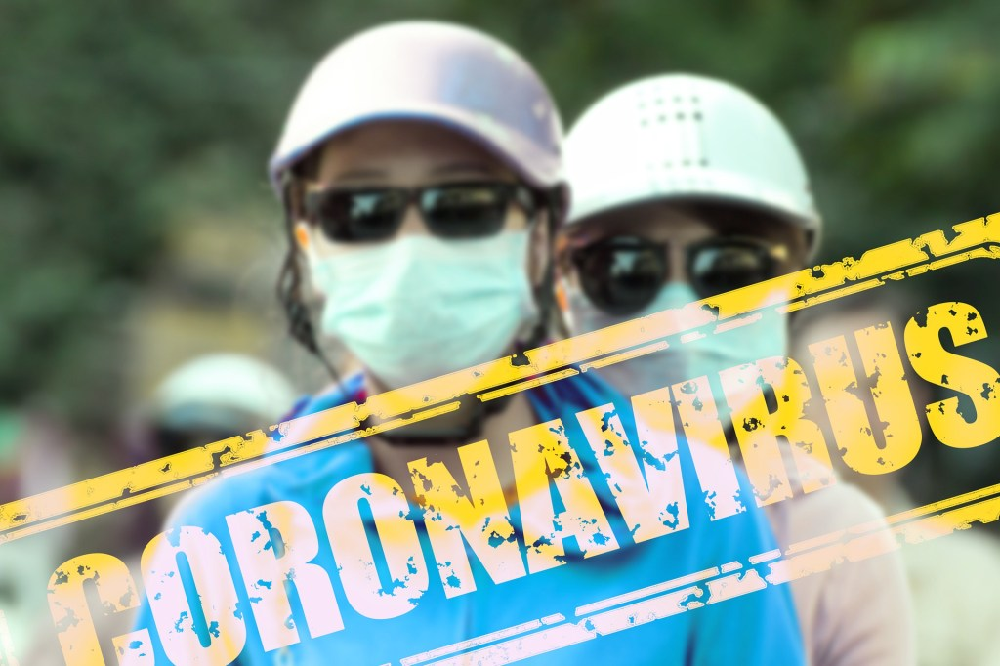

News about the coronavirus outbreak that first started in Wuhan, China, is rapidly changing. The respiratory infection, recently named COVID-19 by the World Health Organization (WHO), is closely related to Severe Acute Respiratory Syndrome (SARS) and Middle-East Respiratory Syndrome (MERS). While the majority of the cases are diagnosed in China, the disease has been diagnosed in more than two dozen countries, including the United States. According to the World Health Organization, coronavirus is a broad family of viruses that cause respiratory illnesses ranging from the well know common cold to more severe diseases such as MERS and SARS. These families of viruses are zoonotic; this simply implies that they are transferred from animals to humans. The name coronavirus comes from a Latin word corona, which means crown. Under an electron microscope, the image of the virus looks like a solar corona.

According to the World Health Organization, common signs of infection by coronavirus include respiratory symptoms, fever, cough, shortness of breath and breathing difficulties. In some severe cases, the infection can cause pneumonia, severe acute respiratory syndrome, kidney failure, and even death.

In order to reduce the risk of the spread of this virus, there is a need for an aggressive campaign to educate the public on how to protect themselves against this new disease. The public needs to be advised to take the following measures:

- Wash your hand regularly with soap under running water.
- Cover your mouth and nose properly when sneezing or coughing.
- Avoid self-medication. Report to the nearest health facility when you experience any of the symptoms of coronavirus disease.
- Health workers should always observe standard infection prevention measures when attending to patients and also take the travel history of the patient.
- Avoid close contact with anyone showing symptoms of respiratory illness such as coughing and sneezing.
- Avoid touching your eyes, nose, or mouth with unwashed hands.
- Cook your meat and eggs thoroughly.
- Clean and disinfect objects and surfaces.

These measures should always be carried out by the public to prevent the spread of the virus because there is no known treatment for diseases as of yet, although many of the symptoms can be treated.

## **Corona Virus Cases in the United States**

As of February 18, 2020, there are a total of 29 cases in the US of COVID-19, this number includes the evacuated cruise ship passengers. The 15 other US cases are in Wisconsin, Illinois, Washington, California, Arizona, Massachusetts, and Texas. The Centers for Disease Control and Prevention (CDC) has a total of 467 persons under investigation for the coronavirus from 41 states and territories. In addition to the 15 confirmed positive, 392 individuals have tested negative.  

Visit us for more updates on coronavirus
