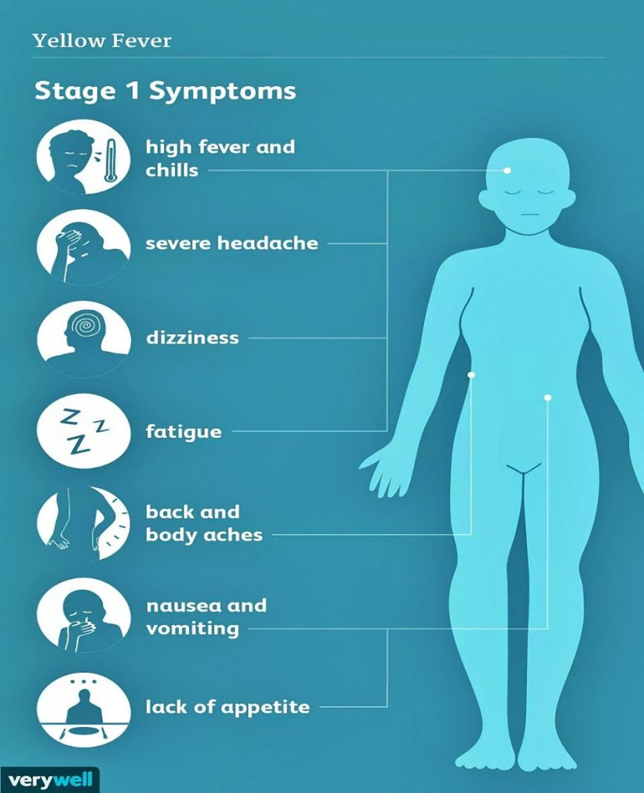
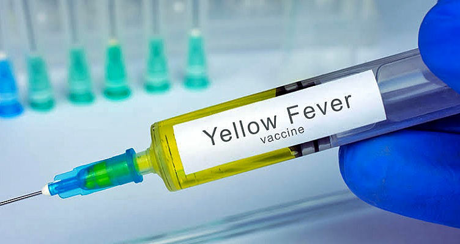

## **What is Yellow Fever?**

Yellow fever is a severe, flu-like, haemorrhagic disease caused by a specific type of virus called the Yellow Fever Virus, which is transmitted among humans through the bite of an infected Aedes mosquito. The disease is specifically endemic to the tropical areas of Africa, Central America and South America where epidemics regularly occur due to the high density of infected Aedes mosquitoes and prevalence of unvaccinated individuals with low immunity to the viral disease. According to statistics from the World Health Organization, there are over 200,000 cases of Yellow fever worldwide each year, with a global mortality rate of about 30,000 deaths, which mostly occurs in low-resource settings with high mosquito burden and inadequate access to the Yellow fever vaccine.

## **What causes Yellow Fever?**

The disease is caused by a specific type of virus transmitted through the bite of infected mosquitoes called Aedes aegypti, which is also known to transmit the Dengue and Zika Viruses among humans. Aedes mosquitoes bear certain physiological similarities but a number of morphological differences from the Anopheles mosquito known to cause Malaria. The mosquitoes breed in humid and semi-humid environments, especially tropical rainforests with prevalence of pockets of still water surfaces. The incidence of the disease is much more common among populations that have not been vaccinated against Yellow fever, which leads to regular small-scale epidemic outbreaks in such regions. The virus, upon entry into the human body, causes extensive damage to the Liver, which leads to the accumulation of unconjugated bilirubin in various parts of the body, especially in the eyes and skin where it is most noticeable. This is known as ‘Jaundice’ and is responsible for the characteristic yellow appearance of the skin and eyes of infected persons, hence, the name of the disease.

## **What are the Signs and Symptoms of Yellow Fever?**

Yellow fever starts out with non-specific symptoms in infected persons, although some individuals do not experience any symptoms initially. The Yellow fever disease typically has three phases, each with its noticeable features. The first phase of symptoms tends to appear about three to six days after exposure to the bite of an infected mosquito, and is usually non-specific as it appears similar to the flu and cannot be easily distinguished from other illnesses. The symptoms include fever and chills, nausea and vomiting, headache, and muscle aches, which lasts about three to four days on average before proceeding to the remission phase in most people, where all the symptoms gradually resolve and the patient improves within two days. Unfortunately, about 15% to 25% of patients proceed to a more severe stage called the toxic phase, where viral haemorrhagic fever occurs, which is characterized by high fever, internal bleeding, extensive liver damage resulting in hepatomegaly (swelling of the liver) and jaundice (yellowing of eyes and skin), vomiting with blood, as well as damage to the kidneys and circulatory system. About half of the patients that proceed to this phase die within seven to ten days if left untreated.

<figure>

<figcaption>

Source: VeryWell Health.  [https://bit.ly/3iwNCWC.](https://bit.ly/3iwNCWC)

</figcaption>

</figure>

## **How can Yellow fever be diagnosed?**

Empirical diagnosis of Yellow fever is usually based on the individual’s symptoms, travel activity and prevalence of Aedes mosquitoes in their residence areas. However, the initial symptoms of the disease are quite similar to a number of other diseases and can not be used as a definitive diagnosis for Yellow fever, except when in the advanced (toxic) phase. The disease can be confirmed through specific blood tests that serve to detect the antigens or antibodies that are peculiar to the virus, and the presence of such antigens or antibodies confirms the positivity of the patient for Yellow fever. It is important to note, however, that antibody tests can only detect the virus about five days after infection, as it takes the body three to five days to produce sufficient antibodies specific to the virus. Polymerase Chain Reaction (in early stages) and ELISA (in later stages) are tests that can be used to detect the antigens and antibodies of the Yellow fever virus respectively.

## **How is Yellow Fever treated?**

So far, no antiviral medication has been approved for the complete treatment of Yellow fever, thus, no cure for the disease exists. Treatment of infected persons requires management of the symptoms with supportive healthcare and the administration of medications that assist the body’s immune system in fighting off the Yellow fever infection. Certain treatment actions that can be taken include ensuring proper hydration and oxygenation of the patient, consumption of a healthy diet, maintaining a healthy blood pressure, and administration of drugs that ease the fever, muscle aches, headaches and vomiting. Any other infections associated with that of the Yellow fever infection can be treated with the appropriate medications as well. These will serve to speed up the recovery of the patient.

<figure>

<figcaption>

Source: Ayushman Hospital.  [https://bit.ly/3BqJGzq.](https://bit.ly/3BqJGzq)

</figcaption>

</figure>

## **How can Yellow fever be prevented?**

The most important means of preventing the Yellow fever infection is vaccination. The Yellow fever vaccine has been long approved by the World Health Organization (WHO) and Centers for Disease Control and Prevention (CDC) as it safe and affordable for most individuals worldwide. A single dose of the vaccine offers life-long protection from Yellow fever and does not require a booster shot. In areas where the disease is highly endemic and vaccination coverage is low, it is necessary to carry out mass immunization campaigns to vaccinate at least 80% of the population in that region in order to achieve herd immunity. This will serve to greatly reduce the rate of transmission of the disease in such regions. Also, individuals travelling to areas where Yellow fever is endemic are also required to get vaccinated for protection against the disease.  
  
Another means of preventing the Yellow fever disease is through vector control in urban and rural areas by eliminating the habitats and breeding sites of Aedes mosquitoes (especially pockets of standing water), and minimizing skin exposure to the mosquito by wearing adequate clothing and making use of topical insect repellants. Insecticide-treated bed nets can also be used to reduce exposure to the vector, but this is limited by the fact that Aedes mosquitoes only bite in the daytime, not at night. Consistent surveillance for Yellow fever cases, especially in unvaccinated communities, is very necessary, and epidemic preparedness strategies should be put in place to ensure swift response to any reports of Yellow fever cases in such communities. 

## **Reference**

- World Health Organization (2019). Yellow Fever. [https://www.who.int/news-room/fact-sheets/detail/yellow-fever](https://www.who.int/news-room/fact-sheets/detail/yellow-fever).
- Health Line (2021). Yellow Fever: Causes, Symptoms and Diagnosis. [https://www.healthline.com/health/yellow-fever](https://www.healthline.com/health/yellow-fever).
- Centers for Disease Control and Prevention (2021). Yellow Fever Vaccine. [https://www.cdc.gov/yellowfever/vaccine/index.html](https://www.cdc.gov/yellowfever/vaccine/index.html).
