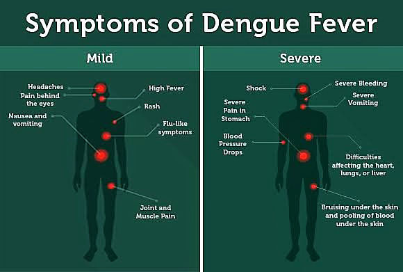

## **What is Dengue Fever?**

Dengue Fever is a severe, painful disease with acute flu-like symptoms caused by a virus that is transmitted through the bite of a particular mosquito species. The disease is also called “breakbone fever” due to the intense pains it causes in the joints and muscles. The disease has a widespread prevalence in over 100 countries worldwide, though it mainly occurs in the tropics and sub-tropics (especially in Asia and Latin America), mostly in urban and semi-urban areas, where the conditions of rainfall and humidity are favorable for mosquito breeding.

The disease prevalence has been on a dramatic rise in recent decades, with about half of the world’s population currently at risk of infection, leading to an estimated 100-400 million cases of infection and over 22,000 deaths each year worldwide. The disease is known to easily cause epidemic outbreaks in regions with a high prevalence of the mosquito vector. Despite not having a very high fatality rate, the severe form of the disease can cause life-threatening complications.   

https://videopress.com/v/zhioOwsf?resizeToParent=true&cover=true&posterUrl=https%3A%2F%2Fvideos.files.wordpress.com%2FzhioOwsf%2Fdengue-fever\_mp4\_std.original.jpg&preloadContent=metadata

## **What causes Dengue Fever?**

The disease is caused by the Dengue Virus (DENV), which is transmitted by the bite of an infected female Aedes mosquito of the species Aedes albopictus and Aedes aegypti. These mosquito species are also notorious for spreading the Zika and Chikungunya Viruses. They breed in areas with stagnant water sources where they lay their eggs, and tend to bite during the daytime. Vertical transmission may also occur from an infected mother to her child, and accidental needle prick cases with infected blood can cause dengue transmission. The Dengue Virus has four serotypes, which are DENV-1, 2, 3 and 4, each with its peculiarities, thus, an individual can be infected up to four times in their lifetime by the different serotypes.

Once the virus gets into the bloodstream of an individual, it proceeds to invade and destroy a number of immune cells, as well as liver cells (hepatocytes) and other body cells. This gives rise to the mediation of inflammation, which manifests as the various symptoms associated with the disease. In most cases, dengue fever may be asymptomatic or present with mild febrile illness that gradually resolves on its own. However, after about 7-10 days, a more severe form known as Dengue haemorrhagic fever or Dengue shock syndrome may develop, usually due to reinfection of the individual with a second DENV serotype. Severe dengue is a leading cause of advanced illness and death in a number of tropical regions, usually occurring when adequate medical attention is not given at the stage of onset.

## **What are the Signs and Symptoms of Dengue Fever?**

In most cases, dengue symptoms are in-apparent or mild and can easily be mistaken for the flu or other forms of infection. Younger children and individuals without prior exposure tend to experience milder symptoms compared to older children, adults and persons with initial cases of infection. The symptoms usually manifest about 4-6 days after infection and may last up to 10 days. They include sudden high fever, severe headaches, nausea and vomiting, fatigue, pain behind the eyes, severe joint and muscle pain, and sometimes a skin rash. People with a weakened immune system or a second dengue infection are at a great risk of developing more severe symptoms and complications characterized by damage to the lymphatic and blood vessels, bleeding from the nostrils or gums, enlargement of the Liver (hepatomegaly) and cardiovascular failure. Without adequate medical attention, the symptoms may culminate into massive bleeding, shock and death eventually. This is known as Severe Dengue, but is also termed Dengue Haemorrhagic Fever or Dengue Shock Syndrome (DSS).

<figure>

<figcaption>

Source: Mosquito Magnet. [https://bit.ly/3CBgJB8](https://bit.ly/3CBgJB8)

</figcaption>

</figure>

## How can Dengue Fever be diagnosed?

The common dengue fever symptoms are usually very similar to those of the flu, thus, such symptoms cannot be used as criteria for diagnosis, except in cases of severe dengue. A number of laboratory tests can be used to confirm dengue fever, such as detection of the virus itself or the antigens and antibodies specific to it using techniques such as Antibody-specific tests, Enzyme-Linked Immunosorbent Assay (ELISA), Reverse-Transcriptase Polymerase Chain Reaction (RT-PCR), etc. Other indicatory tests can be carried out, such as complete blood cell count (CBC), serum protein levels, and panel tests for liver, metabolic and coagulation factors. Chest radiographs, CT scans and Ultrasonography can be used to detect fluid in the chest and abdominal cavities, as well as intracranial bleeding or cerebral oedema.

## How can Dengue Fever be treated?

There is no specific medical treatment for dengue fever, and infected persons are treated by management of symptoms. This includes oral rehydration therapy for dehydrated patients (due to high fever and vomiting), blood and plasma transfusion for patients with severe bleeding symptoms, painkillers and anti-inflammatory drugs such as Ibuprofen and Aspirin, and the use of Acetaminophen to resolve severe headaches. With adequate medical care, the mortality rate of infections can be decreased from 20% to less than 1%, even in cases of severe dengue.

## How best can Dengue be prevented?

The best strategy for curbing the spread of dengue infections is by killing the mosquito vectors directly or destroying their breeding habitats. Drainage of stagnant water sources and water storage containers, as well as spraying of insecticides can be done to get rid of the mosquito breeding sites and directly kill the mosquitoes. Avoidance of mosquito bites can also be achieved by wearing protective clothing outdoors, use of insect repellants and mosquito coils, installment of insect screens on the windows and doors, and sleeping under insecticide-treated mosquito nets.

A Dengue Vaccine known as Dengvaxia (CYD-TDV) has been licensed for vaccination against the disease; however, the vaccine is only used for individuals living in endemic areas who have had previous dengue infection. This is due to the observation that the vaccine may increase the risk of developing severe dengue upon subsequent infection in persons have not experienced Dengue fever before. The vaccine has been deemed safe and efficacious for only persons that have had prior dengue exposure, and as a result, countries utilizing vaccination as part of their dengue control measures must ensure that pre-vaccination screening is carried out to identify those with evidence of a previous dengue infection. Further research is being conducted to produce more vaccines that will be effective in all individuals regardless of prior exposure.

## References

- World Health Organization (2021). Dengue and Severe Dengue. [https://www.who.int/news-room/fact-sheets/detail/dengue-and-severe-dengue](https://www.who.int/news-room/fact-sheets/detail/dengue-and-severe-dengue)
- Dunkin MA (2021). Dengue Fever. WebMD. [https://www.webmd.com/a-to-z-guides/dengue-fever-reference](https://www.webmd.com/a-to-z-guides/dengue-fever-reference)
- Smith DS (2019). Dengue. Medscape. [https://emedicine.medscape.com/article/215840-overview#a1](https://emedicine.medscape.com/article/215840-overview#a1)
