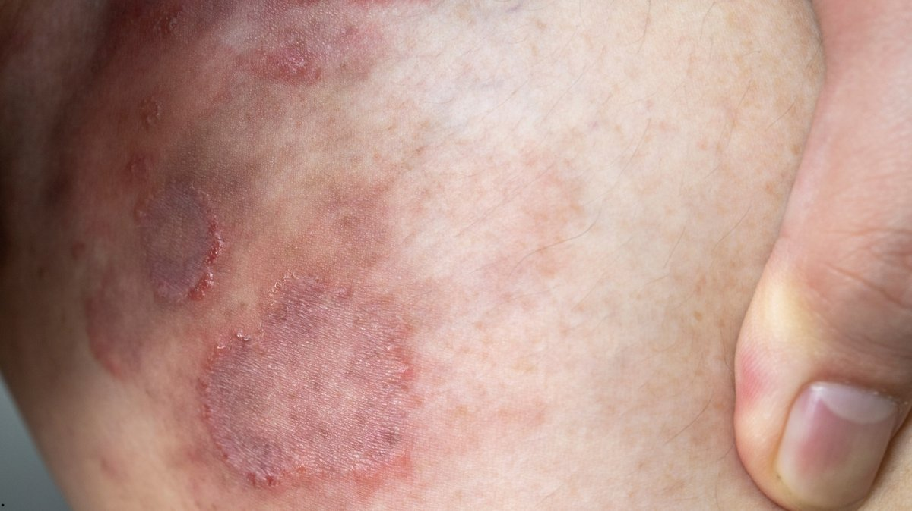
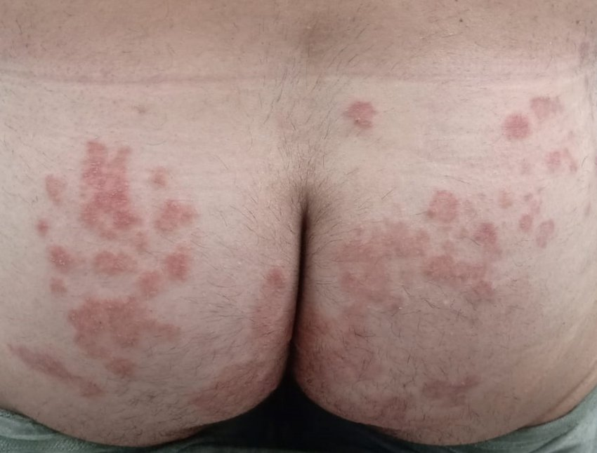

**What Is *****Trichophyton mentagrophytes***** Genotype VII (TMVII)? Understanding the First Sexually Transmitted Fungal Infection**

**(Getty image)**

*Trichophyton mentagrophytes* genotype VII (TMVII) is making headlines after a recent outbreak was reported in Minnesota, following the [first-ever U.S. case reported in New York City in June 2024.](https://www.cdc.gov/mmwr/volumes/73/wr/mm7343a5.htm) TMVII is the world’s first recognized sexually transmitted fungal infection, unlike typical fungal infections such as athlete’s foot or jock itch that spread through casual contact or shared items.

Minnesota is currently reporting the largest known U.S. outbreak, with the [Minnesota Department of Health](https://www.health.state.mn.us/) reporting over 13 confirmed and 27 suspected cases in February 2026, mostly in the Twin Cities metro area. The infection has been steadily rising across Europe for several years, particularly among men who have sex with men.

**What Makes TMVII Different?**

TMVII distinguishes itself from fungal infections primarily through its mode of transmission and clinical presentation. According to the Minnesota Department of Health, TMVII is intensely itchy and inflamed, with scaly patches that often resemble ringworm but tend to be more severe. These lesions are often accompanied by bumps and primarily affect sensitive areas such as the genitals, buttocks, and inner thighs. Without appropriate treatment, TMVII can linger for extended periods and may result in scarring, distinguishing it further from more transient fungal infections, as reported by [Healio](https://www.healio.com/news/infectious-disease/20260216/outbreak-of-sexually-transmitted-fungus-found-in-minnesota).

**Symptoms to Watch for**

Because symptoms can mimic other skin conditions, health officials urge anyone with suspicious rashes and recent sexual contact to get checked at an STI clinic. Common symptoms include;

- Red, irritated, round or oval patches on the skin
- Severe itching and inflammation
- Lesions on the genitals, buttocks, or inner thighs
- Possible scarring if untreated

Scaly plaques on the buttocks, indicative of TMVII infection ([Descalzo et al., 2025](https://doi.org/10.1111/myc.70049))

**How ****Do ****Doctors Detect and Treat TMVII****?**

Diagnosing TMVII involves a combination of clinical examination and [molecular techniques such as genomic sequencing](https://www.cdc.gov/ringworm/hcp/clinical-overview/emerging-ringworm-facts-for-clinicians.html) to ensure accurate identification of the infection. Due to the similarity of TMVII symptoms to infections from other [strains such as T. indotineae or T. rubrum](https://www.cdc.gov/ringworm/hcp/clinical-overview/emerging-ringworm-facts-for-clinicians.html), laboratory confirmation is essential. This usually involves collecting skin scrapings or swabs from the affected area, which are then cultured or examined microscopically to detect the presence of the fungal pathogen.

Once diagnosed, oral antifungal medications, [such as terbinafine or itraconazole](https://www.cdc.gov/ringworm/hcp/clinical-overview/emerging-ringworm-facts-for-clinicians.html), are the mainstay of therapy for several weeks to ensure complete eradication of the fungus and prevent recurrence.

**What Can Individuals Do to Prevent TMVII?**

Preventing the spread of TMVII requires awareness and proactive measures. Individuals are advised to avoid sexual contact when symptoms are present, refrain from sharing personal items like towels or razors, and maintain good hygiene by washing hands thoroughly after touching affected areas. If suspicious rashes develop, prompt medical consultation is recommended to prevent complications and further transmission.

**Summary and Takeaway **

The outbreak of TMVII in Minnesota is a wake-up call for both the public and healthcare providers. It also shows the importance of including fungal infections in routine STI screenings. Although TMVII is treatable, delays in diagnosis can prolong symptoms and increase the risk of spreading the infection. Please seek immediate medical attention if you suspect any of the symptoms mentioned above.

**References**

*Clinician Brief: Emerging Ringworm*. (2026, February 6). Ringworm. [https://www.cdc.gov/ringworm/hcp/clinical-overview/emerging-ringworm-facts-for-clinicians.html](https://www.cdc.gov/ringworm/hcp/clinical-overview/emerging-ringworm-facts-for-clinicians.html)

Descalzo, V., Martín, M. T., Álvarez‐López, P., García‐Pérez, J. N., Alcázar‐Fuoli, L., López‐Pérez, L., Téllez‐Velasco, D., Carrillo, A., Sulleiro, E., Falcó, V., & Arando, M. (2025). Trichophyton mentagrophytes Genotype VII and Sexually Transmitted Tinea: An Observational Study in Spain. *Mycoses*, ***68***(4), e70049. [https://doi.org/10.1111/myc.70049](https://doi.org/10.1111/myc.70049)

*For a healthy Minnesota - MN Dept. of Health*. https://www.health.state.mn.us/

Outbreak of sexually transmitted fungus hits Minnesota. (2026, February 16). *Healio*. [https://www.healio.com/news/infectious-disease/20260216/outbreak-of-sexually-transmitted-fungus-found-in-minnesota](https://www.healio.com/news/infectious-disease/20260216/outbreak-of-sexually-transmitted-fungus-found-in-minnesota)

Zucker, J., Caplan, A. S., Gunaratne, S. H., Gallitano, S. M., Zampella, J. G., Otto, C., Sally, R., Chaturvedi, S., O’Brien, B., Todd, G. C., Anand, P., Quilter, L. A., Smith, D. J., Chiller, T., Lockhart, S. R., Lyman, M., Pathela, P., & Gold, J. A. (2024). Notes from the Field: Trichophyton mentagrophytes Genotype VII — New York City, April–July 2024. *MMWR Morbidity and Mortality Weekly Report*, *73*(43), 985–988. [https://doi.org/10.15585/mmwr.mm7343a5](https://doi.org/10.15585/mmwr.mm7343a5)
