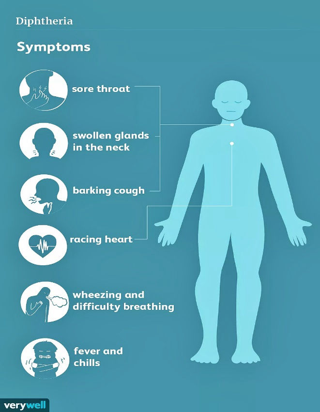
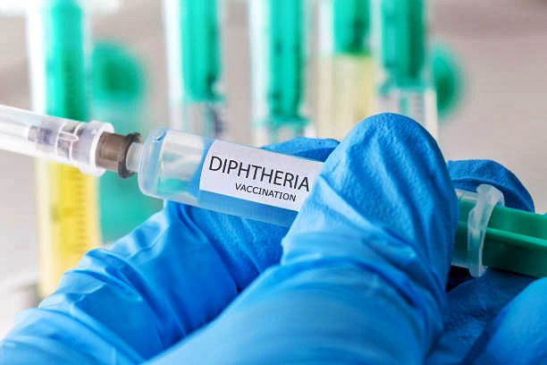

## **What is Diphtheria?**

Diphtheria is a rare, highly communicable disease known to man from as far back as the 5th Century BC, when it was first discovered and described by the Classical Greek Physician, Hippocrates. The disease is caused by a bacterial infection that causes inflammation of the mucous membranes of the upper respiratory tract. Diphtheria outbreaks commonly occur during spring and winter months, and is known to spread quickly, causing a history of epidemics in a number of regions worldwide, especially among children under the age of 15. Due to the presence of effective vaccines and medications, diphtheria is no longer considered a major public health threat, but case fatality ratios of up to 10% have been reported, especially in regions where the vaccine is unavailable and medications for treatment are scarce. 

## **What causes Diphtheria?**

The disease arises from an infection caused by the bacteria Corynebacterium diphtheriae, which infects the mucous membranes of the upper respiratory tract, and can also cause a cutaneous infection of the skin. A similar bacterial specie called Corynebacterium ulcerans is also capable of causing diphtheria, but this is rare. The bacteria are known to produce a powerful toxin that causes localized inflammation and tissue destruction at the site of release (respiratory tract and skin), which can spread to other organs of the body through the lymphatic and circulatory systems. The infection can be transmitted to other persons through inhalation or contact with surfaces bearing respiratory droplets from the cough or sneeze of an infected person, through contact with respiratory secretions such as saliva and mucus, and also through direct contact with the skin lesions or sores of an individual with cutaneous infection. The toxin produced by the bacteria is actually as a result of a certain type of virus (bacteriophage) that they are usually infected with. The production of this toxin is responsible for the development of severe complications associated with the disease.

<figure>

<figcaption>

Source: VeryWell Health. [https://bit.ly/3lWuc0L](https://bit.ly/3lWuc0L)

</figcaption>

</figure>

## **What are the Signs and Symptoms of Diphtheria?**

The signs and symptoms of diphtheria depend on the particular bacterial strain involved and the site of infection. The cutaneous infection which causes skin lesions or ulcers is more prevalent in the tropics and is not as severe as the respiratory infection. The respiratory infection is considered more serious as it is known to cause a severe illness and even death when left untreated. Upon infection, there is an average incubation period of about 5 days before symptoms begin to manifest. The early symptoms appear similar to the flu, but as the disease progresses, the symptoms become more uniquely pronounced. It starts out with a low fever, headaches, chills, malaise, nausea and vomiting, fast heart rate and nasal discharge. 12-24 hours after the onset of initial symptoms, a sheet of thick grey matter (pseudo-membrane) develops at the back of the throat around the tonsil area, causing a sore throat, difficulty swallowing and difficulty breathing.

If the pseudo-membrane extends down to the larynx and trachea, voice hoarseness and a deep barking cough may ensure, and the infected individual stands the risk of having their airways completely obstructed if adequate medical attention is not promptly administered. Continuous disease progression could lead to life-threatening complications if the toxin enters the bloodstream and spreads to other vital organs of the body. Such complications include swelling of the lymph nodes and soft tissues of the neck, inflammation of the heart muscle (Myocarditis), irregular heartbeat, cardiac failure, nerve damage, pneumonia and respiratory failure. The mucous membranes of other organs may become inflamed as well, such as the conjunctiva of the eye, the external ear and the female genital canal. In cutaneous infections, the complications are less severe, however, some disfiguring skin conditions may develop such as eczema, impetigo and psoriasis.

## **How can Diphtheria be diagnosed?**

The diagnosis of diphtheria primarily takes into consideration the medical history and symptoms of the patient. Presence of the characteristic pseudo-membrane in the throat is a definite sign of diphtheria, which can be confirmed with clinical laboratory diagnosis involving sample collection from the nose and throat, culturing in the lab to identify the causative agent, and testing for toxicity. All patients suspected of diphtheria must be tested, along with any individuals they have had close contact with.

## **How can Diphtheria be treated?**

Treatment is most effective when given early, hence, a quick diagnosis is important. There are two components administered in the treatment process, which are the Antitoxin and Antibiotics. The antitoxin acts to neutralize the diphtheria toxin released by the bacteria, and its administration at the initial stage of infection is vital, because once the toxin has bound to various tissues, localized tissue damage occurs and the antitoxin’s effect will be minimal. The antibiotics includes drugs such as Penicillin or Erythromycin, which serve to eradicate the bacteria and limit its spread. Patients with respiratory diphtheria complications require hospitalization for effective treatment and monitoring of recovery.

<figure>

<figcaption>

Source: iStock. [https://bit.ly/3fRTAkn](https://bit.ly/3fRTAkn)

</figcaption>

</figure>

## **How best can Diphtheria be prevented?**

Infected persons should be isolated for treatment and monitoring to minimize the risk of spreading the infection to other people. Healthy, unvaccinated persons are required to avoid contact or close proximity with diphtheria patients, as the disease is highly contagious. Vaccination remains the most effective mode of prevention, as the vaccines are affordable and available in almost all countries worldwide. The vaccine (diphtheria toxoid) is usually incorporated into a vaccine mixture containing the Tetanus toxoid and Pertussis Vaccine, to yield a trivalent combination vaccine called ‘DTaP’ for the prevention of Diphtheria, Tetanus and Pertussis (whooping cough) in young children.

The infant version of the vaccine is administered in 5 doses with at specific age intervals from 2 months, 4 months, 6 months, 15-18 months and 4-6 years. The adult form of the vaccine (Tetanus-diphtheria (Td) toxoid vaccine) is administered every 10 years to maintain immunity. Widespread vaccination campaigns are necessary to suppress the prevalence of the disease in endemic regions, and ensure that herd immunity is achieved.

## **Reference**

- Centers for Disease Control and Prevention (2020). Diphtheria. [https://www.cdc.gov/diphtheria/about/causes-transmission.html](https://www.cdc.gov/diphtheria/about/causes-transmission.html)

- MacGill M (2018). Everything you need to know about Diphtheria. Medical News Today. [https://www.medicalnewstoday.com/articles/159534](https://www.medicalnewstoday.com/articles/159534)

- Lo BM (2019). Diphtheria: Background, Pathophysiology, Epidemiology. Medscape. [https://emedicine.medscape.com/article/782051-overview#a4](https://emedicine.medscape.com/article/782051-overview#a4)
