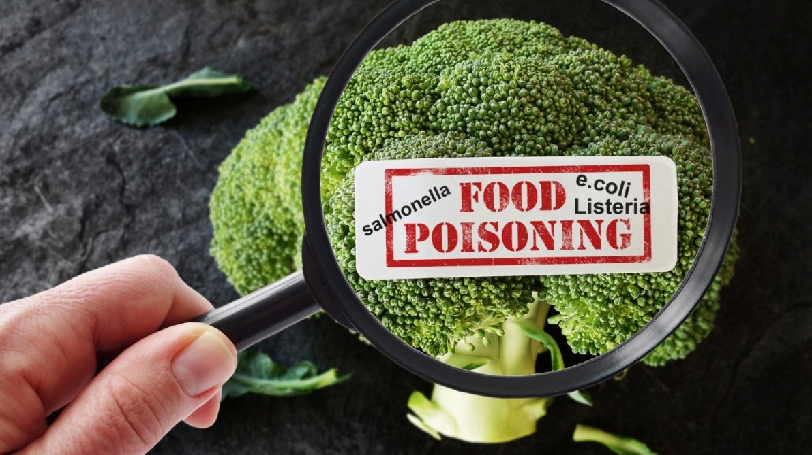

**Food for Thought: Knowing the ****C****auses of Food Poisoning and How ****t****o Prevent It**

**Overview**

Food poisoning is one of the most widespread health problems globally, and it can affect anyone, regardless of age or lifestyle. The Centers for Disease Control and Prevention (CDC) estimates that about 48 million people in the United States get sick from foodborne illnesses each year, with 128,000 hospitalizations and 3,000 deaths ([CDC](https://www.cdc.gov/food-safety/about/index.html)). While most cases are mild and resolve within a few days, some can be severe or even life-threatening.

**What Causes Food Poisoning?**

Food poisoning occurs when food becomes contaminated with harmful bacteria, viruses, parasites, or toxins. The most common culprits include [Salmonella](https://www.cdc.gov/salmonella/about/index.html), [Norovirus](https://www.cdc.gov/norovirus/about/index.html), [Listeria](https://www.cdc.gov/listeria/about/index.html), and [Campylobacter](https://www.cdc.gov/campylobacter/about/index.html). Each of these pathogens can cause uncomfortable symptoms such as diarrhea, vomiting, stomach cramps, and fever. In severe cases, dehydration or complications can require hospitalization.

Contamination can happen at any stage of food production, from farm to table. For example, raw meat and poultry may carry bacteria if not handled properly. Fresh produce can become contaminated if washed with unsafe water or handled with unclean hands. Even seemingly harmless foods, like flour or sprouts, have been linked to outbreaks because they can harbor pathogens before cooking.

Certain foods could be consistently linked to higher risks;

- Raw or undercooked poultry, meat, seafood, and eggs.
- Unpasteurized milk and juices, and soft cheeses made from unpasteurized milk, and raw sprouts.
- Cut fruits like melons if left unrefrigerated.

**Symptoms**** of ****F****ood ****P****oisoning**** and When to Seek Help**

Most cases of food poisoning cause mild symptoms that resolve within a few days. Common signs include nausea, vomiting, diarrhea, abdominal pain, and fever. However, symptoms can vary depending on the pathogen. For example, *Listeria* infections may cause flu-like symptoms but can be especially dangerous for pregnant women, leading to miscarriage or stillbirth ([FDA](https://www.fda.gov/food/foodborne-pathogens/listeria-listeriosis)). Young children, older adults, pregnant women, and people with weakened immune systems are vulnerable and should be particularly cautious.

It’s important to seek medical attention if symptoms are severe, such as;

- prolonged vomiting
- bloody stools
- high fever
- signs of dehydration, such as dizziness and reduced urination.

*Abdominal pain and vomiting are two common signs of food poisoning*

**How to Prevent Food Poisoning**

The encouraging news is that food poisoning is largely preventable. The [USDA](https://www.fsis.usda.gov/food-safety/safe-food-handling-and-preparation/food-safety-basics/steps-keep-food-safe) recommends four simple steps to keep food safe:

- **Clean:** Wash hands with soap and water before and after handling food. Clean cutting boards, utensils, and countertops regularly.
- **Separate:** Keep raw meat, poultry, and seafood away from ready-to-eat foods to avoid cross-contamination.
- **Cook:** Use a food thermometer to ensure foods reach safe internal temperatures. For example, poultry should be cooked to 165°F (74°C).
- **Chill:** Refrigerate leftovers promptly. Do not leave cooked food out for more than two hours, or one hour if the temperature is above 90°F (32°C).

Beyond the basics above, also replace kitchen sponges regularly or disinfect them often, as they can harbor millions of microbes. Pay attention to expiration dates and avoid eating food that looks or smells suspicious.

**Takeaway**

Food poisoning is common, but it doesn’t have to be inevitable. By practicing safe food handling, cooking, and storage, families can reduce their risk. Awareness is the first step: knowing which foods are risky, recognizing symptoms early, and taking preventive measures at home.

The next time you prepare a meal, remember that food safety is as important as taste. Washing your hands, cooking food thoroughly, and refrigerating leftovers promptly are simple actions that protect your health.

**Sources:**

- *About Campylobacter infection*. (2024, May 10). Campylobacter Infection (Campylobacteriosis). [https://www.cdc.gov/campylobacter/about/index.html](https://www.cdc.gov/campylobacter/about/index.html)
- *About listeria infection*. (2024, August 2). Listeria Infection (Listeriosis). [https://www.cdc.gov/listeria/about/index.html](https://www.cdc.gov/listeria/about/index.html)
- *About Norovirus*. (2024, April 24). Norovirus. [https://www.cdc.gov/norovirus/about/index.html](https://www.cdc.gov/norovirus/about/index.html)
- *About salmonella infection*. (2024, October 4). Salmonella Infection (Salmonellosis). [https://www.cdc.gov/salmonella/about/index.html](https://www.cdc.gov/salmonella/about/index.html)
- *Food safety basics*. (2025, November 24). Food Safety. [https://www.cdc.gov/food-safety/about/index.html](https://www.cdc.gov/food-safety/about/index.html)
- *Keep food safe! Food Safety Basics*. (2024, January 5). Food Safety and Inspection Service, U.S. Department of Agriculture (USDA). [https://www.fsis.usda.gov/food-safety/safe-food-handling-and-preparation/food-safety-basics/steps-keep-food-safe](https://www.fsis.usda.gov/food-safety/safe-food-handling-and-preparation/food-safety-basics/steps-keep-food-safe)
- *Listeria (Listeriosis)*. (2025, January 16). U.S. Food And Drug Administration (FDA). [https://www.fda.gov/food/foodborne-pathogens/listeria-listeriosis](https://www.fda.gov/food/foodborne-pathogens/listeria-listeriosis)