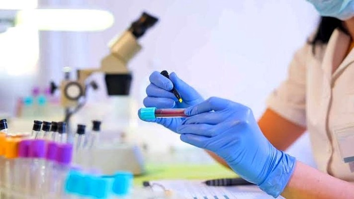

## **What is Gonorrhoea?**

Gonorrhea, also referred to as “the clap” or “drip”, is an infectious sexually transmitted disease (STD) capable of occurring in both men and women. The disease is caused by specific bacteria known to mostly infect the urogenital tract, and occurs as a very common sexual infection among young individuals, especially those aged between 15-24 years old. The bacteria usually target warm and moist areas of the body such as the inner surfaces of the genitalia (urethra, vagina, cervix), rectum, throat and in some cases, even the eyes. Gonorrhoea is considered a public health threat due to the fact that it is one of the most common sexually transmitted infections, infecting over 2 million people worldwide every year. In recent times, the disease has become one of the most antibiotic-resistant infections ever, impeding and prolonging the course of treatment in infected patients.

## ****How does Gonorrhoea cause harm to the body****

The disease is caused by a bacterium called _Neisseria gonorrhoeae_, which usually infects the mucosal surfaces of the body, with a special affinity for the urogenital tract (urinary system and sexual reproductive system). Upon entry into the body, the bacteria attach to the mucosal surfaces and penetrate through the cells into the sub epithelial space, where they cause inflammation (manifests as intense itching) and formation of abscesses (fluid pockets), leading to the production of purulent discharge (pus) from the urogenital tract. As the disease progresses, the bacteria multiply very quickly and spread upwards along the urethra or vagina (lower urogenital tract) to upper organs such as the cervix, which is the major site of infection in females.

If left untreated during the primary infection, the bacteria can spread to other pelvic organs (like the uterus, fallopian tubes, ovaries, etc), causing a condition called pelvic inflammatory disease (PID) that is characterized by intense inflammatory pain around the pelvic area. This mostly occurs in females, while in males, the bacteria can spread to the epididymis, causing epididymitis. In about 1% of gonococcal infections, the bacteria can ultimately spread from the urogenital tract to other parts of the body, a condition called disseminated gonococcal infection (DGI). This is characterized by infiltration of the bloodstream with gonococci (called gonococcaemia), which are transported to other organs of the body like the skin, joints, eyes and pharynx, where they cause clinical manifestations. In the long run, absence of adequate medical treatment could lead to irreversible damage of the reproductive organs (resulting in infertility), damage of other body organs (eyes, brain, liver, heart valves, etc) and various other complications. In some individuals (male or female), the gonococcal strains may cause an asymptomatic infection, meaning that no symptoms will be observed and such persons could serve as carriers of the infection without knowing it.

## **How is Gonorrhoea transmitted?**

The gonorrhoea bacteria are most often passed from one person to another through sexual contact, including oral, anal or vaginal intercourse. Gonorrhoea spreads easily, and sexually active people of any age or gender can get the disease, though it occurs most often in people who have many sex partners and those who do not use condoms. Individuals who do not experience any gonorrhoea symptoms (especially women) can easily spread the disease without knowing it. However, gonorrhoea can not spread through casual touching, such as kissing or hugging, or through sharing bathrooms or plates and cutlery.

Sexually active women younger than 25 and men who have sex with men are at increased risk of contracting gonorrhoea. Other risk factors for the disease include having a new sex partner, multiple sex partners, or having a sex partner who has other partners, and also having had gonorrhoea or another sexually transmitted infection at one point or the other. A pregnant woman with gonorrhoea stands the risk of transmitting the infection to her baby during childbirth.

## **What are the symptoms of Gonorrhoea?**

Symptoms usually occur within 2 to 14 days after exposure, however, some individuals infected with gonococci (gonorrhoea bacteria) may exhibit no symptoms. Infected men with symptoms may have manifestations such as a burning sensation when urinating, production of white, yellow or greenish discharge from the penile urethra, pain during sexual intercourse, and signs of painful or swollen testicles (this is less common).

Most women with gonorrhoea do not have any symptoms. Even when a woman has symptoms, they are often mild and may be mistaken for a bladder or vaginal infection. Women with gonorrhoea are at risk of developing serious complications from the infection, even if they do not show any major symptoms. Women with symptoms of gonorrhoea infection may experience painful or burning sensation when urinating, increased vaginal discharge (with abnormal colour or smell), pain during sexual intercourse, and vaginal bleeding between periods. Rectal infections may be symptomatic or asymptomatic in both men and women. Symptomatic infections may include discharge of rectal fluid, anal itching, soreness, bleeding, painful bowel movements, etc. Disseminated gonococcal infection (DGI) may manifest via signs and symptoms such as rash, fever, joint inflammation (arthritis), inflammation of the walls of the heart (endocarditis), inflammation of the eyes (conjunctivitis), inflammation of the layers of the brain and spinal cord (meningitis), pelvic inflammatory disease, possible risk of infertility, etc.

<figure>

<figcaption>

_Source: Wexner Medical Center._ [_https://bit.ly/3kTjiqY_](https://bit.ly/3kTjiqY)

</figcaption>

</figure>

## **How can Gonorrhoea be diagnosed?**

Gonorrhoea can be diagnosed through various methods. Upon reporting to a medical centre for diagnosis, the first major important aspect that will be noted is the patient’s symptoms, medical history and sexual lifestyle. The definitive diagnosis is done in a medical laboratory through laboratory tests. Samples are gotten from the patient by using a sterile swab stick to collect swabs from the symptomatic area (penis, urethra, vagina, cervix, rectum or throat) and examined microscopically on a glass slide to detect the causative bacteria. Other samples such as Urine, Blood or Synovial fluid may be collected for analysis, especially if disseminated gonococcal infection is suspected. The gold standard diagnostic method involves inoculating the collected sample on a petri dish and incubating it under ideal growth conditions for several days. A colony of gonorrhoea bacteria will grow if gonorrhoea is present, and this colony can be identified through microscopic or biochemical tests. Other diagnostic methods include DNA Probe, Polymerase Chain Reaction (PCR) and Ligand Chain Reaction (LCR). The DNA Probe is an antigen detection test that uses a probe to detect the DNA of gonorrhoea bacteria in specimens. A preliminary test result may be ready within 24 hours, while a final result might take up to 3 days.

**Note:** If one person has a diagnosis of gonorrhoea, their sexual partner or partners should also receive testing.

## ****How can Gonorrhoea be treated?****

The disease is specifically treated with antibiotics to clear off the bacterial infection. However, the emergence of antibiotic-resistant strains of gonorrhoea is a growing challenge, as various gonococcal strains have become extremely resistant to a number of antibiotics, a phenomenon known as ‘multidrug resistance’. This makes the treatment of the gonorrhoea infection very difficult, as more expensive classes of antibiotics need to be used and it takes a longer time to treat the disease, resulting in a much costlier and more extensive treatment regimen. The currently recommended treatment for gonorrhoea is a combination therapy of 250mg of Ceftriaxone (butt injection) and 1g of Azithromycin (taken orally). In cases of high resistance, these drugs could be administered as a 7-day course of treatment before the infection may be completely resolved.

There are no at-home remedies or ‘over-the-counter’ (OTC) medications that are used to treat resistant gonorrhea strains, hence, anyone infected with gonorrhoea is advised to seek medical attention from a licensed healthcare professional and strictly adhere to the drug prescriptions they are given, to avoid intrinsic emergence of resistance to the drugs. After completion of the treatment regimen, it is advised that the individual should allow a time span of at least seven (7) days before having sex again. If a person is treated for gonorrhoea, his/her sexual partner should also receive complete treatment for the disease, followed by a week interval, before sexual intercourse can ensue.

## ****How can Gonorrhoea be Prevented?****

The safest way to prevent gonorrhoea or other STIs is through sexual abstinence. Sexually active individuals are advised to always use a condom, dental dams, or other barrier methods during any form of sexual intercourse. If there is a possibility of confirmation that one’s partner is infected, sexual activity must be avoided until the infected individual is completely treated. It is also important to limit one’s number of sexual partners in order to minimize the risk of getting infected.

## **References**

Centers for Disease Control and Prevention (2015). Gonorrhoea – CDC Fact Sheet. [https://www.cdc.gov/std/gonorrhea/stdfact-gonorrhea.htm](https://www.cdc.gov/std/gonorrhea/stdfact-gonorrhea.htm).

Smith L (2020). What to know about gonorrhoea. _Medical News Today_. [https://www.medicalnewstoday.com/articles/155653](https://www.medicalnewstoday.com/articles/155653).

Kiefer D (2020). Gonorrhoea. _Health Line_. [https://www.healthline.com/health/gonorrhea](https://www.healthline.com/health/gonorrhea).
