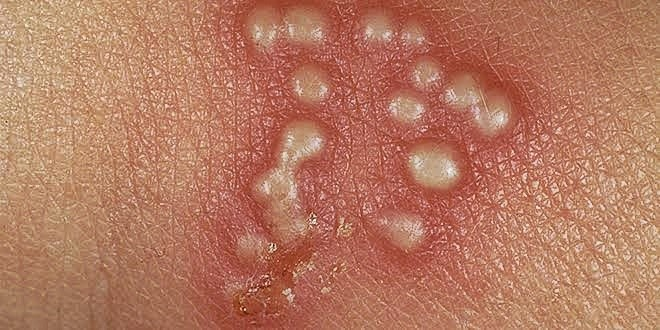

## What is Herpes Simplex?

Herpes is a viral infectious disease known to be sexually transmitted, but can cause infections in other areas such as the central nervous system. The disease is quite common, especially among adolescents and young adults, and many people live with asymptomatic herpes, meaning they have the virus without ever having an outbreak or active episode of herpes symptoms. The World Health Organization (WHO) estimated that 3.7 billion people under the age of 50 (67%) have Herpes Simplex type 1 (HSV-1) infection globally and 491 million people under age 50 (13%) globally have Herpes Simplex type 2 (HSV-2) infection, but the prevalence varies substantially with region. Most genital HSV-1 infections are estimated to occur in America, Europe and the Western Pacific.

## ********What causes Herpes Simplex and how is it transmitted**?******

The disease is caused by the Herpes Simplex Virus (HSV), which belongs to the family of viruses called Herpesviridae, that comprises over 120 viruses and infects a wide range of vertebrates. HSV is categorized into two types – Herpes type 1 (HSV-1 or Oral Herpes) and Herpes type 2 (HSV-2 or Genital Herpes). Most commonly, HSV-1 causes sores around the mouth and lips (sometimes called fever blisters or cold sores). HSV-1 can cause genital herpes, but most cases of genital herpes are caused by HSV-2. In HSV-2, the infected person manifests sores around the genitals or rectum. Although HSV-2 sores may occur in other locations, these sores usually are found below the waist. HSV-1, which is transmitted through oral secretions or sores on the skin, can be spread through kissing or sharing objects such as toothbrushes or eating utensils. On the other hand, a person can get HSV-2 infection during sexual contact with someone who has a genital HSV-2 infection, or through other similar sexual means such as sharing of sex toys and skin-to-skin contact at the infection site. It is important to know that both HSV-1 and HSV-2 can be spread even if the sores are not present. HSV-2 infects women almost twice as often as men because sexual transmission is more efficient from men to women.

<figure>

<figcaption>

[Source: The Dermatology Specialists](https://bit.ly/3GX0sJt)

</figcaption>

</figure>

## **Signs and symptoms of Herpes**

Herpes simplex infections have various presentations, depending on the immune status, the age of the host and the route of transmission. The symptoms also depend on whether the patient’s herpes infection is a first-time experience or a recurrent infection.Oral herpes infection is mostly asymptomatic, but symptoms can include painful blisters or open sores (ulcers) in or around the mouth (cold sores). Infected persons will often experience a tingling, itching or burning sensation around their mouth before the appearance of the sores. These symptoms can recur periodically, and the frequency varies from person to person. Genital herpes can be asymptomatic or have mild symptoms that go unrecognized. When symptoms occur, genital herpes is characterised by one or more genital or anal blisters or ulcers. Additionally, symptoms of a new infection often include fever, body aches and swollen lymph nodes. After an initial episode, which can be severe, symptoms may recur. Genital herpes caused by HSV-1 typically does not recur frequently. With HSV-2, recurrent symptoms are common. However, recurrences are often less severe than the first episode and tend to decrease over time.

Complications of Herpes simplex infection may include neurological morbidity, neonatal herpes due to transmission from an infected mother to her child, meningitis, bladder problems and rectal inflammation.

## **How can Herpes Simplex be diagnosed?**

Empirical diagnosis based on the signs and symptoms of Herpes is not enough, as a number of individuals infected with HSV are asymptomatic. The most accurate means of diagnosing herpes simplex is through laboratory diagnostic tests, which involve methods such as Polymerase Chain Reaction (PCR) and Viral culture. PCR is used to copy the viral DNA from a sample of the carrier’s blood, tissue from sores or spinal fluid. The DNA can then be tested to establish the presence of HSV and determine which type of HSV is present. The sensitivity of PCR is much greater than that of viral culture, but the procedure is more costly. Viral culture involves taking tissue samples or scrapping the sores for examination in the laboratory. Although PCR can detect HSV DNA from later stages of lesions better than virus culture, there is a theoretical risk of false-positive results occurring due to sample contamination. However, viral culture is more cost effective and is regarded as the gold standard for HSV diagnosis.

## **How can **Herpes Simplex** be treated**?

There is no cure for herpes, but treatment is done by managing the symptoms and suppressing the disease through antiviral medications to prevent reoccurrence. Three major medications that help in management of herpes are Acyclovir, Famciclovir and Valacyclovir. Oral Acyclovir treatment of first-episode genital herpes is clinically effective, but it does not seem to prevent the virus’ latency or associated recurrent disease.

## ****How can **Herpes Simplex** be prevented**?**

People with symptoms of oral herpes should avoid oral contact with others (including oral sex) and sharing objects that touch saliva (like toothbrushes and eating utensils). Individuals with symptoms of genital herpes should abstain from sexual activity while experiencing symptoms. Both HSV-1 and HSV-2 are most contagious when the sores are present, but can also be transmitted when no symptoms are felt or visible. For sexually active people, consistent and correct use of condoms is the best way to prevent genital herpes and other STIs. However, HSV infection can still occur through contact with genital or anal areas not covered by the condom. Medical male circumcision can provide life-long partial protection against HSV-2 infection, as well as against HIV and human papillomavirus (HPV).

Pregnant women with symptoms of genital herpes should inform their health care providers. Preventing acquisition of HSV-2 infection is particularly important for women in late pregnancy when the risk for neonatal herpes is greatest

## **References**

1. World Health Organization (2022). Herpes simplex virus. [https://www.who.int/news-room/fact-sheets/detail/herpes-simplex-virus](https://www.who.int/news-room/fact-sheets/detail/herpes-simplex-virus)

2\. Web MD (2020). Herpes Simplex Virus: HSV-1 & HSV-2. [https://www.webmd.com/genital-herpes/pain-management-herpes#1](https://www.webmd.com/genital-herpes/pain-management-herpes#1)

3\. Raypole C (2022). Everything You Need to Know About Oral and Genital Herpes. _Healthline_. [https://www.healthline.com/health/herpes-simplex#hsv-1-vs-hsv-2](https://www.healthline.com/health/herpes-simplex#hsv-1-vs-hsv-2)
