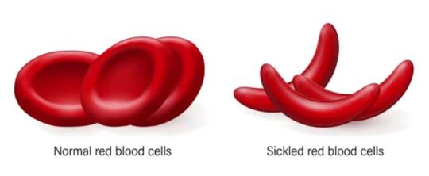
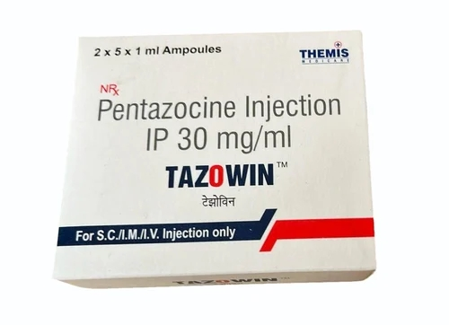

## The Sickle Cell Disease

Sickle cell disease (SCD) is a genetic disorder that affects the red blood cells. Sickle cell patients have red blood cells that contain mostly haemoglobin S which is an abnormal type of haemoglobin different from haemoglobin A, which is found in individuals without the disease. Sometimes, these red blood cells become sickle-shaped i.e. crescent-shaped, and they have difficulty passing through small blood vessels and they get stuck and block blood flow. The sickled cells become oxygen-deprived and die early,  causing a shortage of red blood cells causing pain and other serious complications such as infection, acute chest syndrome and stroke). This is known as a vaso-occlusive crisis. Currently, the only known cure for the disease is a stem cell or bone marrow transplant which is rarely done due to the high risk involved.

About 50 million people are living with SCD globally, with an estimated 150,000 annual births in Nigeria alone, which is the highest in the world and makes the country an epicenter zone at 33% of the global burden of sickle cell disease. At least 100,000 babies die from the disorder in Nigeria every year, according to a 2014 WHO statistics report. The disease is characterized by acute complications like recurrent bone pains, painful crisis, acute anemia, etc., and chronic complications, which include chronic liver disease, leg ulcers and psychosocial complications, amongst others. The goal of treatment is to manage the disease, treat complications and organ damage and prevent further complications.

## ********What** is Pentazocine, and why is it commonly abused by people suffering from Sickle Cell Disease?******

Pain management in SCD patients is crucial and inevitable due to the vaso-occlusive crisis most patients suffer. The primary drug of choice recommended by most physicians is pentazocine, an opioid analgesic used for moderate to severe pain; it improves functional capacity and reduces hospitalization in most SCD patients.

Pentazocine has a combined analgesic and euphoric effect, and prolonged use in sickle cell patients leads to mental and physical dependence. Its interaction with opioid receptors in the brain and spinal cord can lead to addiction. A case report by (Kingsley et al., 2019) detailed a female sickle cell patient who suffered from pentazocine addiction with over three years of self-administration on account of recurrent painful sickle cell bone crisis; and caused her to develop cutaneous and musculoskeletal complications. Another study by (Iheanacho et al., 2015) was carried out in a tertiary hospital in Nigeria among eleven SCD patients who abused pentazocine. It was discovered that in addition to other complications, the majority of the participants had developed contractures and deformities of their limbs (and digits) with varying degrees of loss of joint movement and gait abnormalities due to the parenteral use of the drug.

Despite it being a controlled substance, it is the most readily available opioid analgesic available in Nigeria, unlike morphine and pethidine. Factors contributing to this include the affordability of the medication and ease of access.  A study conducted by (Nnachi et al., 2022) found that 90.4% of SCD patients in Nigeria obtained pentazocine without a doctor’s prescription, primarily from community pharmacies, patent medicine stores and open markets. A disturbing aspect of its use is the increased self-medication, home treatment by health workers or encouragement from fellow patients. The study conducted by (Iheanacho et al., 2015) showed that the majority of the patients purchased the drug without a prescription, and the others forged a prescription.

The ease at which SCD patients have access to this medication is alarming, and there is a need for strict legislation and regulation of the drug. Nigerian clinicians have been found wanting with the rate at which pentazocine is prescribed for the management of acute pain among SCD patients, particularly at the onset of the pain, where it can be managed with NSAIDs and other analgesics that are less addictive and could be administered after a preliminary examination before furtherance to a more potent analgesic which could predispose to addiction. Several authors have documented pentazocine abuse among sickle cell patients in Nigeria, where there is no firm legislation against access to and use of controlled substances. This could be attributed to the higher prevalence of sickle cell disease among people of African ancestry. Moreover, most of the reported victims of pentazocine abuse/dependence were adolescents and young adults suffering from recurrent or chronic pain.

In addition, the role some healthcare workers play in the acquisition of these drugs with ease is a significant issue. Most of the affected individuals had contact with a healthcare worker or a facility where they could procure the drugs without difficulty, and some were even taught how to self-administer the drugs. There is a greater risk of pentazocine addiction amongst healthcare workers who suffer from SCD due to their easy access to acquiring and administering these drugs.

## **RECOMMENDATIONS**

1) There is a need for strict regulations and protocols to ensure the sale of pentazocine is dispensed only with a valid prescription from qualified health professionals.

2) Health workers like Pharmacists and nurses need to be retrained to raise awareness of the dangers of pentazocine misuse and abuse and the importance of following prescription guidelines.

3) Public health campaigns and programmes for sickle cell patients and their families need to be conducted to educate them on the risk of abusing pentazocine, the dangers of self-administration and the need to follow prescription guidelines.

4) Re-education of hematologists and medical physicians on the risk of pentazocine abuse and the need for developing monitoring and reporting systems in cases of abuse.

5) Health Providers should be encouraged to use alternate pain management medications and treatment practices, such as non-opioid analgesics, physiotherapy and psychotherapy, for effective pain management.

6) Sickle cell support groups should also be created to help patients cope, improve their mental health and share positive strategies used for pain management.

7) There is a need for an integrated health approach; physicians, pharmacists, nurses, physiotherapists and psychotherapists should work together to improve the mental and physical state of the patients.

8) Controlled substances like opioids should be sold in limited and regulated amounts only in licensed pharmacies by a licensed pharmacist, and each sale should be appropriately documented; in conjunction, regulatory bodies like the Pharmacists Council of Nigeria should intensify their routine pharmacy investigations.

In conclusion, it is interesting to note that there is a decrease in pentazocine studies amongst developed countries due to the decrease in its abuse, whereas developing countries like India and Nigeria are on the rise. There is a need to further characterize pentazocine abuse/misuse among affected persons living with sickle cell disease in Nigeria to drive positive actions and mitigate this potential menace.

## **References**

1. Centres for Disease Control and Prevention. (2023, July 6). Sickle Cell Disease (SCD): Data & Statistics. Retrieved November 11th, 2023, from [https://www.cdc.gov/ncbddd/sicklecell/facts.html](https://www.cdc.gov/ncbddd/sicklecell/facts.html)

3. Nwabuko, O. C., et al. (2022). An overview of sickle cell disease from the socio-demographic triangle - a Nigerian single-institution retrospective study. Pan African Medical Journal, 41, 161. [https://doi.org/10.11604/pamj.2022.41.161.27117](https://doi.org/10.11604/pamj.2022.41.161.27117)

5. Akinbami, A., Bola, O., Uche, E., Badiru, M., Olowoselu, O., Suleiman, A. M., & Augustine, B. (2019). Pentazocine addiction among sickle cell disease patients and perception of its use among health-care workers. Journal of Applied Hematology, 10, 94-98. Retrieved July 25, 2022, from [https://www.jahjournal.org/text.asp?2019/10/3/94/271025](https://www.jahjournal.org/text.asp?2019/10/3/94/271025)

7. Ernest, S., Kolawole, I., Olorunsola, B., Ogunkunle, O., Ojuola, O., Oyedepo, T., & Jenyo, S. (2019). Pentazocine Abuse in Two Siblings with Sickle Cell Anaemia. Open Journal of Pediatrics, 9, 148-153. [https://doi.org/10.4236/ojped.2019.92016](https://doi.org/10.4236/ojped.2019.92016)

9. Yelne, S., Wanjari, M. B., Munjewar, P. K., Malu, K., & Umate, R. (2022, July 20). A Rare Incidence of Necrotizing Lesion of the Upper Arm Due to Pentazocine Injection Abuse: A Case Report. \*Cureus\*, 14(7), e27046. [https://doi.org/10.7759/cureus.27046](https://doi.org/10.7759/cureus.27046)

11. Nnachi, O. C., Akpa, C. O., Nwani, F. O., Edenya, O. O., & Obukohwo, O. O. (2022). Pentazocine Misuse among Sickle Cell Disease Patients and The Role of Lack of Enforcement of Opioid Dispensing Regulations by Community Pharmacies: A Descriptive Observational Study. \*Advances in Public Health, 2022\*(3877882), 1-6. [https://doi.org/10.1155/2022/3877882](https://doi.org/10.1155/2022/3877882)

13. Kingsley, A., Ofonime, E., Bassey, B. O., Eberechi, O., Ekang, E., Akaba, E., Adaobi, D., & Godwin, O. (2019). Case Report: The Effect of Pentazocine Abuse in a Female Sickle Cell Disease Patient in Calabar, South-south, Nigeria. \*Journal of Pharmaceutical Research International, 29\*(5), 1–7. [https://doi.org/10.9734/jpri/2019/v29i530247](https://doi.org/10.9734/jpri/2019/v29i530247)

15. Iheanacho, O. E., Ezenwenyi, I. P., & Enosolease, M. E. (2015). PentazoAbuseabuse in Sickle Cell Disease Patients Seen at a Tertiary Hospital in Nigeria: A Chronic Menace. \*International Journal of Tropical Disease & Health, 9\*(1), 1–8. [https://doi.org/10.9734/IJTDH/2015/18336](https://doi.org/10.9734/IJTDH/2015/18336)
