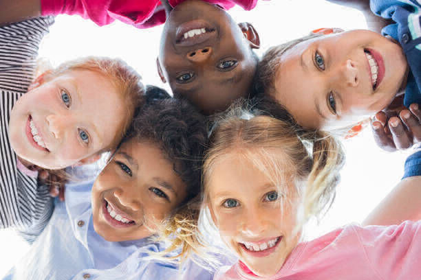

<figure>

<figcaption>

source: _[https://connection.asco.org/](https://connection.asco.org/)_

</figcaption>

</figure>

Amid the devastating death toll and hospitalization due to the current pandemic (COVID-19), the psychological effect on children has been unconscionably ignored. The overwhelming coverage by the media and public health messages sustain quite a high level of physical and emotional threat within our communities, which is intensely observed by children. Age-appropriate explanations are critical to ensure children have a clear understanding and emotional support for their experience. This need is significantly increased when someone in the family is either hospitalized for or dies from COVID-19. 
It is no doubt that COVID-19 predominantly affects adults, especially with patients treated in deliberate isolation from family and friends.

Consequently, children with whom the patient has important relationships are invisible to healthcare staff. The quality of communication with children about life-threatening illness and death has long-term consequences on their psychological well-being as well as family functioning. Therefore, health professionals need to identify the affected children to promote and facilitate effective communication within the family. The diversity of family and social structures means that the healthcare staff contacting the relatives should assume that the patient has a vital role in a child's life.

This type of communication should be tailored to children's evolving developmental understanding of illness and death. Even though most children under three years have yet to acquire a complete knowledge of death, they are still prone to the traumatic effects of severe illness or death within the family. Children are quick observers of their environment; within the first year, infants respond to changes in their caregivers' behavior and mood. Children under the age of 2 become distressed when caregivers or parents leave and seek their return. Children between 3 to 4 years understand death as a departure but might not fully grasp the concept of irreversibility. In other words, they do not know that after death, the dead cannot be made alive again. Therefore it is essential to gently repeat the critical message that the dead will not and cannot return to life again. By the age of 5 to 6, children appreciate the finality and irreversibility of death and recognize their mortality, but are not until around age ten that children acquire a full mature comprehension of death.

Research shows that parents want guidance from healthcare professionals regarding how to approach children about illness and death. Again, the need for this support is increased when family or caregivers are self-isolating together, and adults have little space, time, or privacy to prepare how they will share the news with children.

COVID-19 presents a mystifying array of challenges for healthcare professionals, public services, and communities worldwide. Empowering adults to communicate with children about illness and death effectively has the potential to mitigate the short-term and long-term psychological effects. The news that children face about COVID-19 might seem almost unspeakable, but together we must find words and means to give voice to their experience and prevent millions of children struggling with their fears and uncertainty alone.
