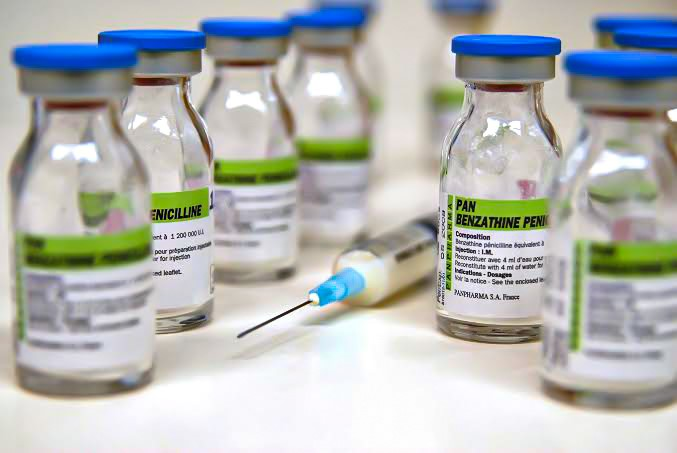

## What is Syphilis?

Syphilis is a highly contagious disease caused by the bacterium _Treponema pallidum_, which is mostly spread through sexual activity, including oral and anal sex. Infected persons often do not realize early enough that they have the disease, and are very likely to pass it on to their sexual partner. Syphilis was once considered a major public health threat due to the serious long-term problems associated with it, such as arthritis, brain damage, and blindness. There was no effective treatment until the late 1940s, when the antibiotic Penicillin was developed. According to the CDC, the rate of new cases of syphilis dropped in the 1990s, till 2000 when it reached an all-time low. However, since then, the disease rate has been on a constant increase worldwide. Majority of syphilis cases (64%) occur among gay, bisexual, and other men who have sex with men (MSM), but the prevalence of the disease has also been increasing among heterosexual men and women.

## **What causes Syphilis?**

The causative bacteria _Treponema pallidum_, is known to inhabit the mucous membranes of humans, specifically the sexual reproductive organs and other orifices involved in sexual activity such as the anus and the mouth. Syphilis is transmitted from person to person by direct contact with a syphilitic sore, known as a ‘chancre’. Chancres can occur on or around the external genitals (penis and labia), in the vagina, around the anus, in the rectum, and may also occur in or around the mouth (especially the lips). Transmission of syphilis mainly occurs during vaginal, anal or oral sex, but can also be transmitted through cuts on the skin and mucous membranes. In addition, pregnant women with syphilis can transmit the infection to their unborn child (congenital syphilis). There are a number of risk factors that predispose one to contracting syphilis, such as having unprotected sex, having multiple sex partners, being a same-sex couple (especially men who have sex with men), and being infected with HIV.

**Note:** Syphilis can not be spread via toilet seats, doorknobs, swimming pools, hot tubs, bathtubs, shared clothing, or eating utensils. The disease is also unlikely to be spread through kissing, except with an individual possessing chancres in or around the mouth.

## **What are the symptoms of Syphilis?**

The average time between acquisition of syphilis and the start of the first symptom is 21 days, but can range from 10 to 90 days. Syphilis has been called “The Great Pretender”, as its symptoms can look like many other diseases. However, syphilis typically follows a progression of stages that can last for weeks, months, or even years. There are four stages of syphilis, which are the primary, secondary, latent and tertiary stages. The disease is most infectious in the first two stages. When syphilis is in the hidden (latent stage), the disease remains active but often with no symptoms. Tertiary syphilis is the most destructive to health.

**Primary syphilis:**

The primary stage of syphilis occurs about three to four weeks after a person gets infected with the bacteria. It begins with a small, round, fluid-filled sore called a chancre. A chancre is painless, but it is highly infectious and direct contact with it serves as the major route of transmission, usually occurring during sexual activity (including oral sex). This sore may appear wherever the bacteria enters the body, such as on or inside the mouth, genitals, or rectum. On average, the sore shows up about three weeks after infection, but it can take between 10 and 90 days to appear. Upon appearance, the sore remains for about two to six weeks.

**Secondary syphilis:**

Secondary syphilis is often mistaken for another condition, due to the non-specificity of its symptoms. Skin rashes and a sore throat may develop during the second stage of syphilis. The rash does not itch and is usually found on the palms and soles, but may occur anywhere on the body. Some individuals might not notice the rash till it goes away. Other symptoms of secondary syphilis may include headaches, swollen lymph nodes, fatigue, fever, weight loss, hair loss and aching joints. These symptoms will eventually go away, whether treatment is received or not. However, without treatment, the person still has syphilis.

**Latent syphilis:**

The third stage of syphilis is the latent or hidden stage. The primary and secondary symptoms disappear, and there is an absence of any noticeable symptoms at this stage. However, the bacteria remain in the body. This stage could last for years before progressing to tertiary syphilis.

**Tertiary syphilis:**

The last stage of infection is tertiary syphilis. Approximately 15-30% of people who do not receive any treatment for syphilis will enter this stage. Tertiary syphilis can occur years or decades after the initial infection, and its effects can be life-threatening. Some potential outcomes of tertiary syphilis include blindness, deafness, mental illness, memory loss, destruction of soft tissue and bone, neurological disorders (stroke or meningitis), heart disease, and neurosyphilis (an infection of the brain or spinal cord).

<figure>

<figcaption>

_Source: NBC News._ [_https://bit.ly/3CJR2x3_](https://bit.ly/3CJR2x3)_._

</figcaption>

</figure>

## **How can Syphilis be diagnosed?**

When syphilis is suspected, a physical examination is carried out and the individual’s sexual history is ascertained before carrying out clinical tests to confirm syphilis. Different testing methods exist, which include blood tests to detect antibodies against the syphilis bacteria (from current or past infection), extraction of chancre fluid during the primary or secondary stage for microscopic detection of the bacteria, and collection of cerebrospinal fluid through a ‘spinal tap’, to be examined in order to monitor the disease’s effects on the nervous system (in a case of neurosyphilis). Pregnant women must be screened for syphilis to ascertain their safety status and prevent the foetus from being infected with congenital syphilis, as its effects on a newborn can be fatal. If a person is diagnosed of syphilis, they must notify any sexual partners, and their partners should also undergo testing. Testing for HIV is also recommended.

## **How can Syphilis be treated?**

Primary and secondary syphilis are easy to treat with a penicillin injection administered intramuscularly. Penicillin is one of the most widely used antibiotics and is usually effective in treating syphilis. People who are allergic to penicillin will likely be treated with a different antibiotic, such as doxycycline, azithromycin or ceftriaxone. If one has neurosyphilis, treatment will involve daily doses of penicillin intravenously, which often requires a brief hospital stay. Early treatment of syphilis is vital, as lack of medical attention can result in complications and long-term damage to body organs. The damage caused by tertiary syphilis can not be reversed, even with treatment, as the bacteria will be killed, but the damage will remain. Such treatment will most likely focus on easing pain and discomfort.

During treatment, individuals are advised to strictly avoid sexual contact until all their sores are healed and a medical professional has deemed it safe to resume sex. Infected persons undergoing treatment should get their partner treated as well, and sexual activity must not be resumed until both patients have completed treatment

## ******How can one prevent Syphilis?******

The best way to prevent syphilis is by complete abstinence or at least, practicing safe sex by making use of condoms during any type of sexual contact. In addition, it may be helpful to use a dental dam (a square piece of latex) during oral sex. It is important to avoid sharing sex toys, and also avoid direct contact with the sores of an infected person, as long as healing is not complete. Syphilis can also be transmitted through shared needles, thus, it is necessary to avoid sharing needles while injecting drugs. It is advisable that all sexually active persons should regularly get themselves screened for Syphilis and other STIs, to ensure early detection in case of an infection.

## **References**

Centers for Disease Control and Prevention (2021). Syphilis – CDC Detailed Fact Sheet. [https://www.cdc.gov/std/syphilis/stdfact-syphilis-detailed.htm](https://www.cdc.gov/std/syphilis/stdfact-syphilis-detailed.htm).

Johnson S (2019). Syphilis. _Health Line_. [https://www.healthline.com/health/std/syphilis](https://www.healthline.com/health/std/syphilis).

Smith L (2019). What to know about syphilis. _Medical News Today_. [https://www.medicalnewstoday.com/articles/186656](https://www.medicalnewstoday.com/articles/186656)
