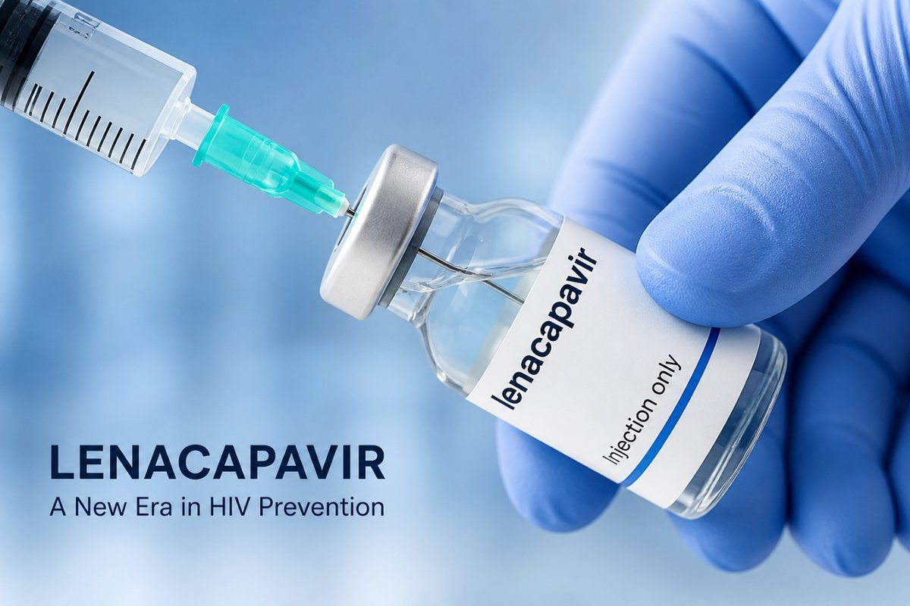
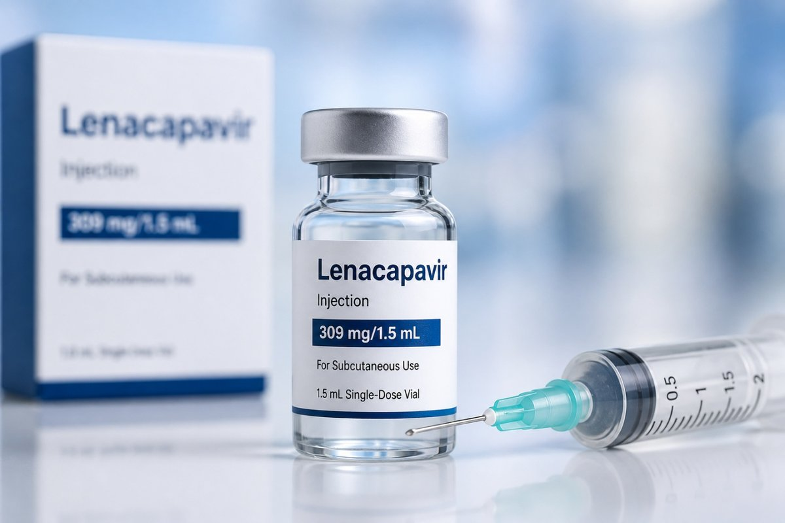

**The 6-Month HIV Shield: ****Lenacapavir**** ****as a**** Game-Changer in HIV Prevention and Treatment**

Decades of progress in HIV treatment have transitioned the virus from a death sentence to a manageable chronic condition. The fight has relied heavily on daily medications, behavioral interventions, and public health awareness. While these approaches have saved millions of lives, they also come with challenges, especially adherence to daily pills. Despite progress, millions of new infections still occur each year, particularly in regions with limited access to healthcare. Lenacapavir, a long-acting injectable drug, is now transforming how we prevent and treat HIV.

**What Exactly Is ****Lenacapavir****?**

Lenacapavir is an antiviral medication designed to stop HIV from replicating in the body. Other traditional HIV drugs, while effective on their own in suppressing the virus, are almost [always used in combination (often 3-drug therapy)](https://hivinfo.nih.gov/understanding-hiv/fact-sheets/hiv-life-cycle) to prevent the virus from developing resistance, as relying on a single agent allows HIV to mutate.

However, Lenacapavir works by inhibiting the HIV capsid, a protein shell that protects the virus and facilitates infection of human cells. By disrupting this capsid, the drug blocks multiple stages of HIV’s replication, making it highly effective, even against strains resistant to other medications.

**What Makes ****Lenacapavir**** Different from Vaccines? **

It’s important to clarify that Lenacapavir is not a vaccine. Vaccines train your immune system to recognize and fight infections. Lenacapavir, on the other hand, is a pre-exposure prophylaxis (PrEP) drug which prevents infection by stopping the virus before it can establish itself in the body. This is a breakthrough for people at high risk of HIV exposure, including those in [serodiscordant relationships,](https://www.nhsinform.scot/hiv-prep-pre-exposure-prophylaxis/one-partner-is-hiv-positive-the-other-is-negative/) who are newly starting treatment and have not yet achieved an undetectable viral load.

**How Does ****Lenacapavir**** Provide Protection with Only Two Doses a Year?**

One of the biggest challenges of current HIV prevention methods is the need for [daily oral pills](https://hivinfo.nih.gov/understanding-hiv/fact-sheets/hiv-life-cycle), and missing a dose can reduce effectiveness.

Lenacapavir changes this completely.

- It is administered as an injectable drug just twice a year (once every six months).
- After injection, the drug is gradually released into the bloodstream, sustaining protection over time.
- The drug can remain in the body for [up to 12 months,](https://www.askgileadmedical.com/len4prep/understanding/) making it especially useful for people who struggle with daily medication routines.

**How Effective Is ****Lenacapavir****?**

In large-scale studies, Lenacapavir demonstrated [up to 99% effectiveness](https://www.askgileadmedical.com/len4prep/understanding/) in preventing HIV infection among participants when used as PrEP. This level of protection matches, and sometimes even exceeds, that of daily oral regimens. For treatment, it has also shown [effectiveness in people with multidrug-resistant HIV](https://www.eatg.org/hiv-news/lenacapavir-drug-offers-new-hope-for-multidrug-resistant-hiv/), where other therapies have failed. This dual role in both prevention and treatment really makes Lenacapavir stand out as a valuable option.

**What Are the Limitations**** of ****Lenacapavir****?**

- Cost and availability may limit access in low-income regions
- Lenacapavir remains in the body for up to 12 months, but its levels gradually decline below protective thresholds [about six months after the last dose](https://www.askgileadmedical.com/len4prep/dosing-admin/).
- Exposure during this low-level phase may allow the virus to develop resistance, reducing future treatment options.
- Missing or delaying the 6-month injection can compromise effectiveness. Oral PrEP is recommended if injections are delayed.

**Final Takeaway**

Lenacapavir is a major step forward in the fight against HIV. While it is not a cure, it brings us closer to a future where HIV transmission is drastically reduced and possibly eliminated. As science continues to evolve, innovations like Lenacapavir remind us that ending HIV is becoming an achievable reality and no longer just a goal.

**References**

- Lenacapavir: Drug offers new hope for multidrug-resistant HIV | EATG. EATG. [https://www.eatg.org/hiv-news/lenacapavir-drug-offers-new-hope-for-multidrug-resistant-hiv/](https://www.eatg.org/hiv-news/lenacapavir-drug-offers-new-hope-for-multidrug-resistant-hiv/)
- NHS inform. (2023, April 25). One partner is HIV positive, the other is negative | HIV PrEP | NHS inform. NHS Inform. [https://www.nhsinform.scot/hiv-prep-pre-exposure-prophylaxis/one-partner-is-hiv-positive-the-other-is-negative/](https://www.nhsinform.scot/hiv-prep-pre-exposure-prophylaxis/one-partner-is-hiv-positive-the-other-is-negative/)
- The HIV Life Cycle | NIH. [https://hivinfo.nih.gov/understanding-hiv/fact-sheets/hiv-life-cycle](https://hivinfo.nih.gov/understanding-hiv/fact-sheets/hiv-life-cycle)
- Understanding Lenacapavir for pre-exposure prophylaxis │ Gilead Medical Information. Information on Implementation of LEN for PrEP. [https://www.askgileadmedical.com/len4prep/understanding/#studies](https://www.askgileadmedical.com/len4prep/understanding/#studies)
- *Lenacapavir** for PREP | Dosing & Administration │ Gilead Medical Information*. Information on Implementation of LEN for PrEP. [https://www.askgileadmedical.com/len4prep/dosing-admin/](https://www.askgileadmedical.com/len4prep/dosing-admin/)