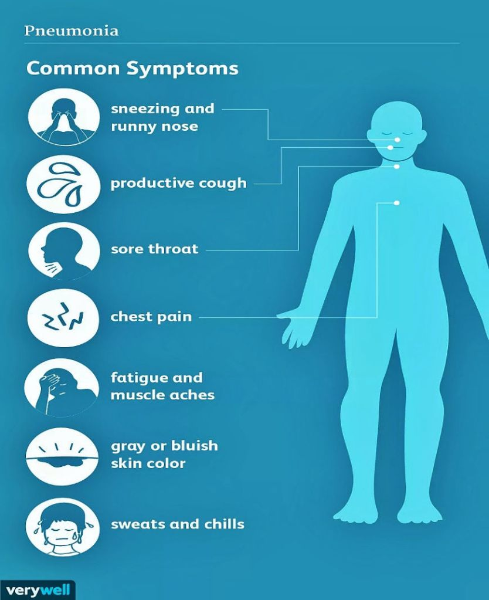

## **What is Pneumonia?**

Pneumonia is an acute respiratory infection that causes inflammation of the alveoli (air sacs) in the Lungs. The disease is mostly common among children and is the single largest infectious cause of child deaths worldwide, accounting for an average of about 15% of all deaths in children under five years of age. Despite having a global distribution, the disease is more prevalent in Southern Asia and Sub-Saharan Africa. Individuals at high risk for pneumonia include infants, young children, the elderly, and people with underlying medical conditions.

## **What causes Pneumonia?**

The disease is caused by various infectious pathogens, including bacteria, viruses and fungi. Examples include Streptococcus pneumoniae (bacteria), Haemophilus influenzae (bacteria), Legionella pneumophilia (bacteria), Respiratory Syncytial Virus (RSV), Rhinoviruses, Influenza Virus and Pneumocystis jiroveci (fungi). Some of these pathogens (bacteria and viruses) exist as natural flora in the nasal airways or throat, and only become infectious when they descend and invade the Lungs. They can also be transmitted by inhalation of respiratory droplets from the cough or sneeze of an infected person suffering pneumonia. The causative fungi in fungal pneumonia can be contracted from the environment. Upon gaining entry into the Lungs, these pathogens release toxins that elicit inflammation of the respiratory air sacs (alveoli), causing them to become swollen with pus and inflammatory exudate (fluid). This makes breathing difficult and painful (because the alveoli are filled with pus), and limits the amount of oxygen inhaled, giving rise to a feeling of suffocation.  

<figure>

<figcaption>

Source: VeryWell Health. [https://bit.ly/3ywslDb](https://bit.ly/3ywslDb)

</figcaption>

</figure>

## **What are the Signs and Symptoms of Pneumonia?**

The severity of the disease can range from mild to severe and life-threatening. The initial signs and symptoms of pneumonia appear mild and are similar to those of a cold or flu, such as fever, chills, headaches and fatigue. As the disease progresses, the symptoms worsen to result in repeated bouts of coughing with phlegm (thick mucus), difficulty breathing, shortness of breath, chest pain when taking a deep breath (pleuritic pain), high fever, fast heartbeat, nausea and vomiting, loss of appetite and restlessness. Convulsions and transient unconsciousness may occur in infants. The symptoms of viral and bacterial pneumonia are similar, however, viral pneumonia tends to have more symptoms, and wheezing (sharp whistling sound while breathing) is usually observed.  
Children with a healthy immune system may be able to fight the infection and recover, while those with a weak or compromised immune system (malnourished children) tend to develop more severe symptoms and have a higher likelihood of fatality. Pre-existing medical conditions such as HIV, Measles and Asthma, as well as smoking, also increase the likelihood of severity and fatality. 

## **How can Pneumonia be diagnosed?**

Pneumonia symptoms serve as a primary guide during diagnosis, however, a number of diagnostic techniques exist, which include Chest X-Ray (for signs of inflammation), Culturing of Sputum and Blood samples to identify the causative pathogen, Pleural aspiration of fluid (from the space surrounding the Lungs) for analysis, and the use of a Bronchoscope inserted via the throat and into the Lungs to inspect the respiratory airways.

## How can Pneumonia be treated?

Treatment of pneumonia depends on the severity of the symptoms. Bacterial pneumonia is treated with antibiotics targeted at the causative bacteria, while viral pneumonia mainly requires rest and proper feeding, but antiviral medications can also be used. Fungal pneumonia is treated with appropriate antifungal medications. Asides medications against the causative pathogens, some over-the-counter (OTC) drugs like Aspirin, Ibuprofen and Paracetamol (Acetaminophen) may also be prescribed for patients to help manage the pneumonia symptoms. These drugs work by reducing the fever, weakness, headaches and chest pains, and also suppressing the cough to a zero or minimal level. In very severe cases, the patients may be hospitalized and treated with intravenous medications, along with supplementary oxygen therapy to aid breathing.

A key approach to treating pneumonia in addition to medications is eating a healthy diet, staying hydrated with lots of fluid (to thin out the thick mucus), and getting adequate bed rest for full recovery to take place. Most individuals recover from pneumonia within one to three weeks.

## **How best can Pneumonia be prevented?**

  
General preventive approaches against pneumonia include washing hand regularly, maintaining a strong immune system by eating a healthy diet, exercising regularly and getting enough sleep, maintaining proper personal and environmental hygiene, avoiding contact with surfaces that may have been exposed to respiratory droplets from a pneumonia patient, and also refraining from smoking.  
  
Vaccination still remains the most effective way of preventing pneumonia infections. Several approved vaccines exist that prevent the development of pneumonia from specific infectious pathogens. Some of them include Prevnar 13, Pneumovax 23, Influenza vaccine, Hib vaccine, Pertussis vaccine, and a number of others. These vaccines offer immunity to a wide range of pneumonia-causing pathogens. Although they may not always give 100% protection in all cases, vaccinated individuals who get infected subsequently will only experience very mild symptoms and a lower risk for complications.

## Reference  

- World Health Organization (2019). Pneumonia. [https://www.who.int/news-room/fact-sheets/detail/pneumonia](https://www.who.int/news-room/fact-sheets/detail/pneumonia)
- Mayo Clinic (2020). Pneumonia – Symptoms and Causes. [https://www.mayoclinic.org/diseases-conditions/pneumonia/symptoms-causes/syc-20354204](https://www.mayoclinic.org/diseases-conditions/pneumonia/symptoms-causes/syc-20354204)
- Normandin B (2019). Everything you need to know about Pneumonia. Health Line. [https://www.healthline.com/health/pneumonia](https://www.healthline.com/health/pneumonia)
