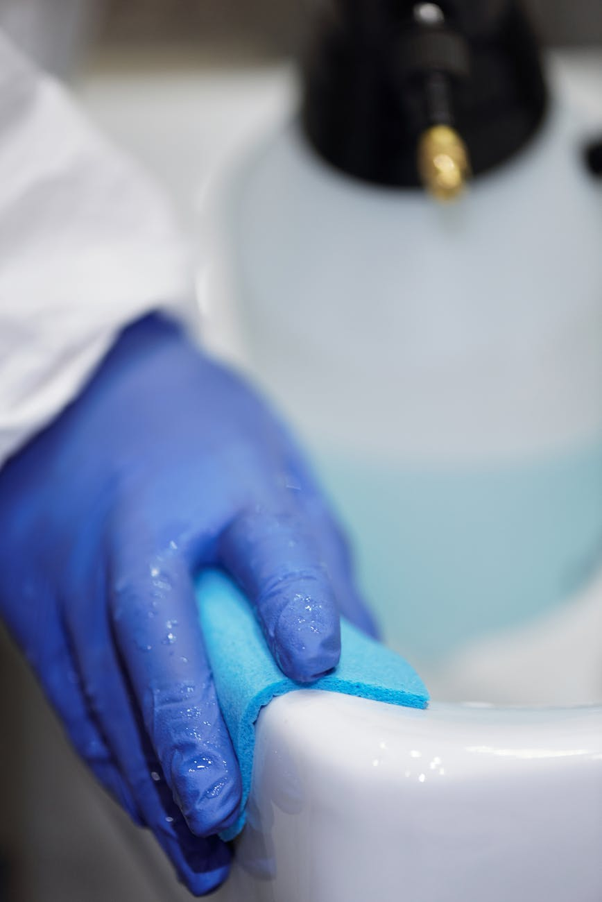

When we think of dirty places, our minds often jump to public toilets or refuse dumps. But what if some of the germiest places are things you touch daily, often without even thinking? Germs are found everywhere, in the air, on surfaces, and even within the human body. Germs can be classified into bacteria, fungi, viruses, and parasites. The collection of these microorganisms living together within a specific environment is known as the microbiome. They are microscopic and can cause illness or infections. While some of these organisms are harmful and can cause diseases, many are harmless and even beneficial to our health, a group known as the healthy microbiome. Read on and let us explore the common hotbeds of the harmful organisms, understand why they are risky, and offer simple steps to protect ourselves and our loved ones.

### **Your Mobile Phone: A Pocket-Sized Germ Hub**

As was stated by the [School of Public Health](https://www.ualberta.ca/en/public-health/news/2017/september/is-your-cell-phone-really-10-times-dirtier-than-a-toilet-seat.html) of the University of Alberta, our phone may carry 10 times more bacteria than a toilet seat. From swiping with unwashed hands to setting it down on various surfaces, such as church pews, office or work desks, our phone becomes a reservoir for microbes. Most people do not regularly disinfect their phones, even though they bring them into kitchens, bathrooms, and bedrooms. Germs like _Staphylococcus aureus_ and E. coli can survive for hours or days on surfaces, making our phones a silent health threat.

### **ATM Machines and Elevator Buttons: High-Touch, Low-Clean**

Public touchpoints like ATM keypads and elevator buttons are touched by dozens, if not hundreds, of people daily.

A study published in the [National Institute of Health’s (NIH) National Library of Medicine](https://pmc.ncbi.nlm.nih.gov/articles/PMC4242253/) found that hospital elevator buttons were often more contaminated than public toilet surfaces. Think about it, people sneeze, cough, scratch, and then press the same buttons we touch, especially in ATMs that welcome many people of different caliber, including traders. Bacteria, viruses, and even drug-resistant strains can linger.

### **Door Handles, Shopping Cart Handles, and Handrails: Germ Express**

How often do we clean or sanitize our home doorknobs? Do we talk about the stair rails in public buildings, schools, and hospitals, which are often overlooked during routine cleaning? These surfaces serve as transmission points for infectious diseases like influenza, the common cold, and COVID-19. The [World Health Organization](https://www.who.int/teams/integrated-health-services/infection-prevention-control/hand-hygiene) has emphasized the importance of frequent hand hygiene to prevent such transmissions.

Also, grocery stores are filled with bacteria-laden carts. There should not be skepticism about it. A 2011 study by Professor Charles Gerba, the lead researcher at the University of Arizona, reported by [CBS News](https://www.cbsnews.com/losangeles/news/study-fecal-bacteria-found-on-most-supermarket-shopping-carts/), found that about 72% of tested shopping cart handles were contaminated with fecal bacteria. These carts are rarely sanitized between uses, and children often lick or touch them, further spreading germs.

### **Kitchen Sponges: Germs at Home**

Let us bring it home to our doorsteps; not all germy places are public. Inside our kitchen, the moist environment of a kitchen sponge supports bacteria like _Salmonella_, _Campylobacter_, and _Listeria_, all of which can cause foodborne illness. How about our dirty dishes, which are not properly washed? A 2017 scientific report published in [Nature](https://www.nature.com/articles/s41598-017-06055-9) revealed massive colonization of used kitchen sponges by _Acinetobacter_, _Moraxella,_ and _Chryseobacterium_ species.

<figure>

<figcaption>

Photo by Matilda Wormwood on [Pexels.com](https://www.pexels.com/photo/person-in-blue-gloves-cleaning-the-sink-4098759/)

</figcaption>

</figure>

### **Protecting Yourself: Simple Hygiene Habits That Work**

Practicing good hand hygiene is the hallmark of human health and well-being. Washing our hands frequently with soap and water, especially before eating or touching our face, is a good step in the right direction. Inclusively, using hand sanitizers (at least 60% alcohol) when soap and water are unavailable will help kill the microbial load on our hands. Weekly disinfect high-touch items like our phones, handrails, doorknobs, and light switches, and avoid touching our faces, especially eyes, nose, and mouth, after touching public surfaces. The [Centers for Disease Control and Prevention](https://www.cdc.gov/clean-hands/about/index.html) (CDC) confirms that hand hygiene is one of the most effective ways to reduce the spread of infectious diseases.

### **Final Thoughts: Small Actions, Big Impact**

Although living in a completely germ-free world is impossible, knowing where microbes hide can help us make more intelligent choices. Maintaining good hygiene habits not only keeps us safe but also helps protect our entire community. Use a knuckle or an item (like a car key) to press buttons, when possible, especially in ATMs and elevators, and most importantly, sanitize our phones weekly, as it is one of the germiest items you use daily. Good hygiene, in line with the Water, Sanitation, and Hygiene (WASH) of the [WHO](https://www.who.int/health-topics/water-sanitation-and-hygiene-wash#tab=tab_1), is a prerequisite to good health and contributes to livelihoods.
