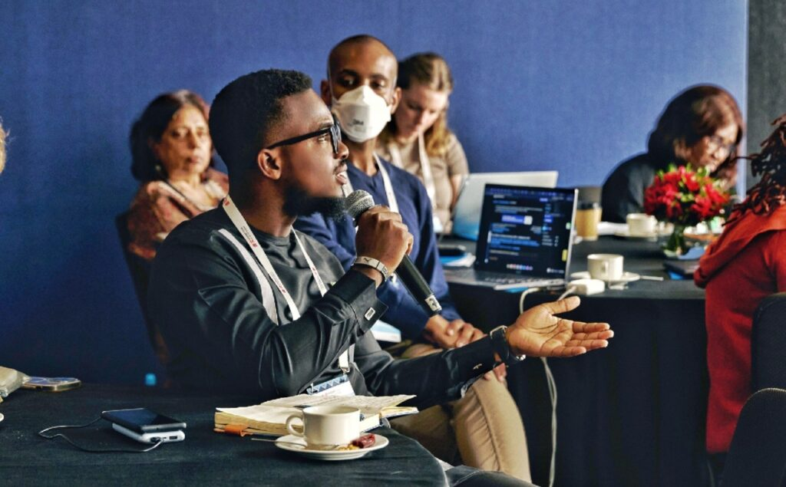

The [HIV Research for Prevention (HIVR4P) Conference](https://www.iasociety.org/conferences/hivr4p2024), organized by the [International AIDS Society (IAS)](https://www.iasociety.org/), is the only global scientific conference focused exclusively on the challenging and fast-growing field of HIV prevention research. The conference serves as an avenue for knowledge exchange on Pre-Exposure Prophylaxis (PrEP), HIV vaccines, microbicides, and biomedical interventions, as well as their social and behavioural implications.

The [5th HIVR4P conference](https://www.iasociety.org/conferences/hivr4p2024) took place in the city of Lima, Peru, from October 6th to 10th, 2024. The conference brought together over 1,300 participants from 58 countries, 40 professions and 180 organizations, including 203 scholarship recipients, 108 abstract presenters, 350 abstracts presented, and 21 journalist fellows. Featured in the conference were the latest evidence and emerging tools from HIV prevention research in over 60 sessions – including plenary presentations, invited-speaker symposia, oral abstract sessions and satellites.

The significance of hosting the HIVR4P conference in Latin America, particularly in Peru, was as a result of the region’s growing HIV epidemic and the urgent need for enhanced prevention strategies. Between 2010 and 2023, there was a 9% increase in new HIV acquisitions in Latin America – a stark contrast to other areas where HIV rates are declining, thanks to the increased use of Pre-Exposure Prophylaxis (PrEP). In the words of [Beatriz Grinsztejn](https://www.iasociety.org/governing-council/beatriz-grinsztejn), President of the IAS, “We hope that by holding the conference in Lima, we can help draw attention to the urgent need to scale up HIV prevention efforts across Latin America”.

## **Game-changing Developments in HIV Prevention: Lenacapavir Takes the Lead**

One of the most promising developments unveiled at the conference was the effectiveness of [Lenacapavir](https://clinicalinfo.hiv.gov/en/drugs/lenacapavir/patient), a PrEP drug to be injected twice a year, which has shown exceptional efficacy in reducing HIV acquisition. According to data from clinical trials presented by [Prof. Colleen Kelley](https://med.emory.edu/directory/profile/?u=CFKELLE) of Emory University, lenacapavir achieved a 100% reduction in HIV acquisition in the [PURPOSE 1 trial](https://www.prepwatch.org/resources/purpose-1-summary/) conducted among cisgender women in Africa. On the other hand, in the [PURPOSE 2 trial](https://www.gilead.com/news/news-details/2024/gilead-presents-full-purpose-2-data-results-for-twice-yearly-lenacapavir-for-hiv-prevention-at-hiv-glasgow), which included cisgender gay, bisexual men, and transgender individuals in multiple countries, the drug demonstrated a 96% reduction.

These findings were a source of excitement for the scientific community, as it represents a significant leap in HIV prevention, especially for vulnerable populations and those in under-resourced regions. Furthermore, this innovation is particularly important because it is much more convenient to receive a biannual PrEP injection instead of the conventional [daily oral medication](https://hivinfo.nih.gov/understanding-hiv/fact-sheets/pre-exposure-prophylaxis-prep) to prevent HIV, and also effectively tackles the challenge of adherence to oral PrEP pills. As Grinsztejn noted, “Lenacapavir has the potential to transform the global HIV prevention landscape for people of all genders.”

## **More Long-acting Tools: The Dapivirine Vaginal Ring and Other Innovations**

To address concerns about the cost of accessing the drug, [Gilead Sciences](https://www.businesswire.com/news/home/20241006981896/en/Gilead-Presents-Additional-Efficacy-Safety-and-Demographic-Data-From-PURPOSE-2-Trial-at-5th-HIV-Research-for-Prevention-Conference) has announced new agreements with six pharmaceutical companies to allow them produce and distribute generic lenacapavir in 120 countries with high HIV rates and limited resources. These agreements, which come without royalty fees, will cover mostly low- and lower-middle-income countries (LMICs) and were signed ahead of global regulatory approvals. This will help ensure that these nations can quickly introduce affordable versions of the drug once it is approved for HIV prevention.

In addition, the official press conference brought attention to a [drug-agnostic, refillable subdermal implant](https://www.sciencedirect.com/science/article/pii/S0168365923008155) that can provide ultra-long-acting delivery of antiretroviral medications for HIV prevention. This device is implanted under the skin, and is designed to deliver different antiretroviral medications, depending on which drug is best suited for the patient, rather than being compatible with only one particular drug. Such innovative approach could pave the way for even longer-lasting prevention options, reducing the need for frequent interventions and making HIV prevention more accessible.

<figure>

<figcaption>

_SFDP Media Representative,_ [_Emmanuel Elebesunu_](https://www.linkedin.com/in/emmanuelelebesunu/) _during Journalism Fellowship session at HIVR4P 2024._

</figcaption>

</figure>

## **Addressing Key Knowledge Gaps: HIV Vaccines and Combination Therapies**

While the search for an HIV cure remains elusive, promising advancements in vaccine research were also highlighted. Currently, [research is underway](https://www.aidsmap.com/news/jun-2024/germline-targeting-future-hiv-vaccine-development) to investigate new ways to administer experimental vaccines that target specific early-stage immune cells, known as [germline B cells](https://www.nature.com/articles/s41590-024-01833-w), which are the precursors to antibodies. These vaccines are designed to train the immune system to produce strong and effective antibodies that can block HIV from infecting cells, especially during the critical early phase when HIV first enters the body. This approach is part of cutting-edge research to develop a vaccine that can offer long-lasting protection against HIV, addressing one of the most challenging aspects of controlling the virus.

Another crucial area of research presented at HIVR4P 2024 was the interaction between [long-acting Cabotegravir](https://www.who.int/news/item/28-07-2022-who-recommends-long-acting-cabotegravir-for-hiv-prevention), an already approved injectable PrEP drug, and hormonal contraceptives. The [data](https://www.hptn.org/sites/default/files/inline-files/HPTN%20084%20DHI%20R4P_Marzinke_Final_Oct2024.pdf) confirmed that there were no pharmacologic interactions between these two agents, hence, women who rely on [hormonal contraceptives](https://www.who.int/news/item/29-08-2019-who-revises-recommendations-on-hormonal-contraceptive-use-for-women-at-high-hiv-risk) for family planning can also freely use cabotegravir as an effective means for HIV prevention. This finding is pivotal in advancing combination strategies for HIV prevention and reproductive health.

## **A Call to Action: Making Prevention Accessible for All**

Despite the [extraordinary advances](https://www.iasociety.org/news-release/new-data-twice-yearly-lenacapavir-hiv-prevention-announced-hivr4p-2024) showcased at HIVR4P 2024, there is still much work to be done to ensure that these innovations reach the people who need them most. For populations living in regions with rising HIV rates, like Latin America, the introduction of effective tools such as lenacapavir and the dapivirine vaginal ring could be game-changers. But without equitable access, the promise of these tools remains unfulfilled.

The IAS has issued a [call for global collaboration](https://www.iasociety.org/about-corporate-partnership-programme), urging stakeholders – from governments and NGOs to pharmaceutical companies and grassroots organizations – to work together in ensuring that these prevention tools are rapidly and equitably distributed. One key message that stands out from HIVR4P 2024 is the fact that despite the unavailability of a cure for HIV, various tools are already available to prevent new infections and save lives. As Grinsztejn aptly stated, “No one should have to wait for a cure when we have powerful prevention tools available today.”

The road to an HIV-free future is paved with innovation, and as the global scientific community continues to push the boundaries of HIV research, the challenge will be ensuring that these ground-breaking innovations reach every corner of the world, to make HIV prevention more accessible, convenient, and effective.
