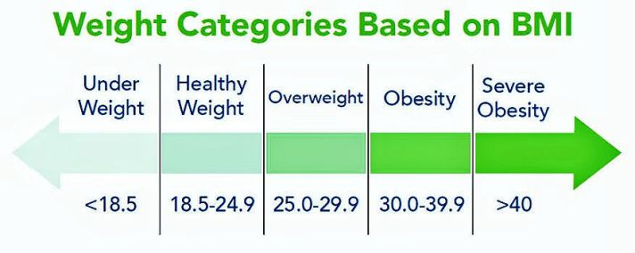
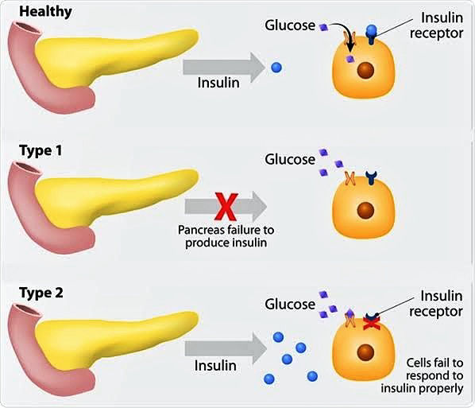
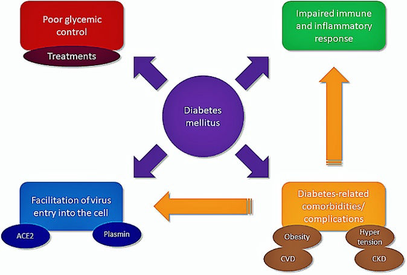

## **What is Obesity?**

Generally, the term ‘obesity’ is attributed to individuals that appear to be overweight in an unhealthy way. However, obesity is actually defined as having a **body mass index of 30kg/m2 or higher**. The Body mass index (BMI) is a measure of one’s body weight in relation to height, in order to determine the body size. There are certain BMI ranges used to classify the weight of individuals in terms of health, as can be seen in the diagram below:

<figure>

<figcaption>

_Source: Obesity Action Coalition.  [https://bit.ly/39AtuiQ.](https://bit.ly/39AtuiQ)_

</figcaption>

</figure>

## **What causes Obesity?**

There are a number of contributing factors that can lead to an individual becoming obese. Some of them include:

**•** Overconsumption of calories in one’s diet – When you consume more calories than you burn in a day through overeating for long periods, this can result in accumulation of the extra calories and can lead to unhealthy weight gain.

**•** Not exercising enough – Living a sedentary lifestyle that does not involve regular exercise and locomotory activities can also cause quick weight gain due to minimal burning of calories.

**•** Aging – Elderly individuals usually have a slower metabolic rate, less muscle mass and carry out fewer activities, thus, they tend to gain weight more easily than younger persons. This is the reason why elderly persons are advised to exercise regularly so as to reduce the chances of unhealthy weight gain.

**•** Pregnancy – Due to the higher metabolic rate observed in pregnancy, expectant mothers are usually likely to develop a high appetite and consume more calories than they burn off, which increases their risk of becoming obese.

**•** Not getting enough sleep – When you do not get enough sleep, certain hormonal changes tend to occur, which can make you get hungry more quickly and consume more high-calorie meals.

**•** Depression – Individuals battling with depression may sometimes develop unhealthy eating habits as an emotional coping mechanism, which can cause quick weight gain.

**•** Genetic causes – Certain genetic factors can affect the way one’s body processes food for energy use, and can also affect fat storage functions, making it easier for the individual to gain weight quickly.

Some other factors that can increase one’s risk of weight gain and obesity include specific disease conditions like Hypothyroidism, Cushing syndrome and Osteoarthritis.

<figure>

<figcaption>

_Source: Wasatch Peak Family Practice.   [https://bit.ly/3cssWxI.](https://bit.ly/3cssWxI)_

</figcaption>

</figure>

## **What is Diabetes?**

More accurately put, **Diabetes mellitus (DM)** is a metabolic disease characterized by high levels of glucose in the bloodstream, usually as a result of insufficient levels of insulin. A fasting blood glucose level higher than 125mg/dl is diagnosed as diabetes mellitus. This condition is more common among individuals that consume unhealthy levels of calories and sugar containing foods, however, there are a number of other causes. There are different types of diabetes, which include:

**•** Type 1 Diabetes Mellitus (T1DM): This is an autoimmune metabolic disease that occurs when the body’s immune system starts attacking and destroying cells in the Pancreas, which is the organ that produces insulin. The reason for this is not exactly known, but it is usually genetic-related or may possibly be caused by a viral infection of the Pancreas. Though it is less common than type 2 diabetes, it is more likely in children and young individuals.

**•** Type 2 Diabetes Mellitus (T2DM): This type of diabetes occurs when the body cells develop resistance to insulin due to a number of reasons, of which abdominal fat and obesity are notorious factors. As a result, the body cells do not take up glucose and it accumulates in the bloodstream.

**•** Gestational Diabetes: This type of diabetes occurs during pregnancy due to certain hormones produced by the placenta that block the effects of insulin on the body’s cells, causing reduced glucose uptake and subsequent accumulation.

**•** Prediabetes: This occurs when one’s blood glucose level is higher than the normal range (75-120mg/dl), but is not high enough to be diagnosed as diabetes.

**•** Diabetes Insipidus: Though this condition shares a similar name with Diabetes mellitus, it is actually not related to high blood glucose levels, but rather, is caused by removal of excessive amounts of fluid (in urine) from the body by the kidney. The condition was given a similar name to diabetes mellitus as it bears a resemblance to one of the symptoms of DM, which is excessive urine production and fluid loss.

<figure>

<figcaption>

_Source: News Medical Life Sciences.   [https://bit.ly/3pAEPFs.](https://bit.ly/3pAEPFs)_

</figcaption>

</figure>

## **What causes Diabetes?**

Diabetes occurs as a result of the body’s inability to effectively take up glucose from the bloodstream, which results in accumulation and high blood glucose levels. Insulin is a hormone produced by the pancreas that stimulates body cells to take up glucose, thus, when insulin is not produced in sufficient amounts (T1DM) or the body cells do not respond to the insulin produced (T2DM), glucose is not absorbed by the body, and it builds up in the bloodstream, causing damage to various organs like the eyes, kidneys, nerves, etc., and a number of other negative health effects. There is a direct correlation between obesity and diabetes, and there is also proof of genetic factors that increase the likelihood of diabetic occurrence in certain individuals.

## **What is the relationship between Obesity and Diabetes?**

Many research studies so far have established the fact that obesity is a high-risk factor for diabetes, and recent research shows that obese individuals with a BMI of 30kg/m2 and above are about 80 times more likely to develop type 2 diabetes than those with a BMI below 22kg/m2. Though the exact reason why obesity leads to diabetes is not yet fully understood, it has been confirmed that excessive abdominal fat in obese persons greatly decreases the sensitivity of the body’s cells to insulin. This occurs because fat cells (adipocytes) spontaneously release certain substances called ‘pro-inflammatory mediators’, which are generally involved in an inflammatory response, but are also known to decrease insulin responsiveness because they interfere with the ability of the cells to chemically bind to the insulin circulating in the blood. Another scientific explanation is that obesity may cause certain chemical changes to some components of the antibodies circulating in the blood, and these changes cause the antibodies to bind to and inhibit a particular enzyme that is responsible for the transfer of insulin from the bloodstream to the body tissues.

Obesity is also known to trigger metabolic changes in the body by the release of fat molecules into the blood, which also reduce insulin sensitivity. In all research studies carried out so far, the bottom line is that obesity greatly increases one’s risk of developing type 2 diabetes mellitus (T2DM).

<figure>

<figcaption>

_Source: Springer Link.  [https://bit.ly/36uszyF.](https://bit.ly/36uszyF)_

</figcaption>

</figure>

## **What is the relationship between Diabetes and COVID-19?**

Several clinical studies have shown that COVID-19 patients with underlying medical conditions like diabetes, cardiovascular diseases and respiratory conditions have higher rates of morbidity and mortality, especially resulting in their admission to hospital Intensive Care Units (ICUs). The typical disease complications observed in diabetes mellitus like hypertension, heart failure and chronic kidney disease are factors that aggravate the severity of the COVID-19 infection. Elevated blood glucose levels (hyperglycemia) have been observed to facilitate viral entry into the body’s cells and also indirectly increase the viral replication of SARS-CoV-2, thus, increasing the viral load in the COVID-19 patient and worsening the associated disease complications.

Also, research shows that the inflammatory response caused by the coronavirus has ways of increasing insulin resistance by interfering with the normal functions of the skeletal muscles and liver, which are the major insulin-responsive organs in the body. Once these organs lose their insulin sensitivity, they become unable to effectively take up insulin, and the blood glucose level keeps rising.

Diabetic patients usually experience a reduction in the efficacy of certain immune cells such as the Helper T-Cells and Natural Killer (NK) Cells. As a result, the immune systems of such patients are unable to fully fight the COVID-19 infection, thus, making the individual more susceptible to the disease. Also, certain drugs used for the clinical management of COVID-19 patients, like Corticosteroids and Antiviral agents, are known to increase blood glucose levels and might worsen the diabetic symptoms/signs in such patients.

## **How can the complications of Obesity, Diabetes and COVID-19 be avoided?**

The major step necessary to prevent diabetes and its complications is weight control, by cultivating regular exercise habits and diet regulation of calories to reduce the risk of developing obesity and excessive abdominal fat. Methods like having a ‘weight loss accountability schedule’ can be set up between the individual and their medical adviser to ensure strict commitment to the weight control measures. Losing a fair amount of body weight can greatly improve the insulin sensitivity of the body cells and lower one’s risk of developing obesity and subsequent type 2 diabetes. The prescriptions of medications for managing diabetes should be strictly adhered to in order to avoid the emergence of complications in the long run. Diabetic COVID-19 patients need to be given special medical attention to prevent case worsening and increased mortality.

## **References**

- World Health Organization (2020). Obesity. [https://www.who.int/health-topics/obesity#tab=tab\_1](https://www.who.int/health-topics/obesity#tab=tab_1)  
    Moores D. (2020). Obesity. [https://www.healthline.com/health/obesity#complications](https://www.healthline.com/health/obesity#complications).  
    Watson S. (2020). Diabetes. [https://www.healthline.com/health/diabetes](https://www.healthline.com/health/diabetes).  
    Lim S, Bae JH, Kwon HS, Nauck MA. COVID-19 and diabetes mellitus: from pathophysiology to clinical management. Nature Reviews Endocrinology. 2020; 17:11-30.
