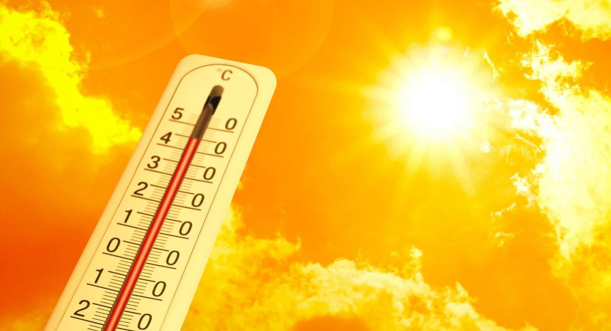
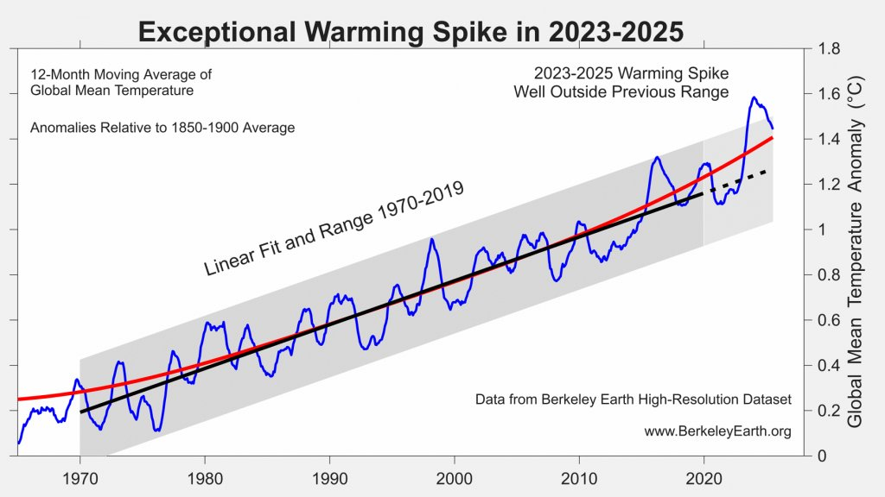

As we move further into 2026, the world is witnessing a startling climatic shift. Recent data shows that “unbearably hot days” are multiplying at an alarming rate across the globe. Extreme heat can affect anyone, but without proper awareness and precautions, it can quickly lead to serious health problems. According to an independent analysis by [Berkeley Earth](https://berkeleyearth.org/global-temperature-report-for-2025/), which processed over 523 million temperature measurements globally, 2025 was officially the third warmest year on record since 1850. This data, surpassed only by 2024 and 2023, confirms an extraordinary three-year streak of extreme global heat, highlighting a shift in our climate.

**Why is it getting Hot?**

The current rise in global temperatures is mainly linked to the increased [greenhouse effect](https://science.nasa.gov/climate-change/faq/what-is-the-greenhouse-effect/), in which human activities, especially the burning of fossil fuels such as coal, oil, and gas, have raised atmospheric CO2 levels to over 425 ppm. This buildup of heat-trapping gases is worsened by deforestation, which removes the planet's natural carbon sinks, and methane emissions from industry and agriculture. According to the [Intergovernmental Panel on Climate Change (IPCC)](https://www.ipcc.ch/report/ar6/syr/resources/spm-headline-statements/), this human-driven increase in the atmosphere's heat-trapping capacity has led to a warming rate that is unprecedented in at least the past 2,000 years.

**How Extreme Heat Affects Your Health**

In response to heat or exercise, the [eccrine sweat glands](https://pmc.ncbi.nlm.nih.gov/articles/PMC5508982/) produce watery fluid (sweat) that evaporates to help cool the body. This is a homeostatic process for thermoregulation. However, in high humidity or extreme temperatures, this process can fail, leading to fatigue, weakness, headaches, and dizziness. In severe cases, there could be;

- **Heat Exhaustion:** Characterized by heavy sweating, rapid pulse, dizziness, and fatigue.
- **Heat Stroke:** A medical emergency where the body temperature rises above [104°F (40°C).](https://www.ncbi.nlm.nih.gov/books/NBK537135/) This can lead to organ failure or death if not treated immediately.
- **Dehydration:** Excessive fluid loss that can lead to kidney stones and electrolyte imbalances.

**Who Is Most at Risk**** of Extreme Heat****?**

While extreme heat affects everyone, it's especially important to pay extra attention to some groups who are more vulnerable. Children, the elderly, people with ongoing health conditions, outdoor workers, and those without access to cool places should take additional precautions during hot weather. Also, watching out for early signs of heat-related illness can help keep everyone safe. These signs include:

- Excessive sweating or, in severe cases, no sweating at all
- Rapid heartbeat
- Confusion or irritability
- Muscle cramps
- Unusual tiredness

If you notice these symptoms getting worse, don't hesitate to seek medical help right away. While waiting for help, move the person to a cool area and apply cool water to their skin.

*Annual Temperature Anomaly Report** showing an exceptional spike in 2023-2025** according to *[Berkeley Earth.](https://berkeleyearth.org/global-temperature-report-for-2025/)

**How to Protect Yourself**** ****From**** ****Extreme Heat**** and Heat-related Illnesses**

The good news is that many heat-related illnesses can be easily avoided. Just small daily habits can really help keep you safe and comfortable:

- **Stay Hydrated****: **Drink plenty of water throughout the day, even if you are not thirsty. Avoid excessive caffeine and alcohol, as they act as diuretics and speed up dehydration.
- **Limit Exposure to Heat****: **Stay indoors during the hottest parts of the day, usually between late morning and mid-afternoon.
- **Wear Light Clothing****: **Choose loose, breathable clothing that allows your body to cool properly.
- **Use Shade and Ventilation****: **Stay in shaded or well-ventilated areas. If possible, use fans or air conditioning.
- **Avoid Strenuous Activities in Peak Heat****: **Schedule outdoor activities for early morning or evening when temperatures are lower.

**Final Takeaway**

The climate is changing, but our ability to adapt and protect our health remains in our hands. By staying informed and taking these simple preventive steps, we can reduce the risks of this rising heat trend. Stay cool, stay hydrated, and stay safe. Your health and safety matter, even on the hottest days.

**Sources: **

- Cui, C., & Schlessinger, D. (2015). Eccrine sweat gland development and sweat secretion. *Experimental Dermatology*, *24*(9), 644–650. [https://doi.org/10.1111/exd.12773](https://doi.org/10.1111/exd.12773)

- Morris, A., & Patel, G. (2023, February 13). *Heat stroke*. StatPearls - NCBI Bookshelf.
- [https://www.ncbi.nlm.nih.gov/books/NBK537135/](https://www.ncbi.nlm.nih.gov/books/NBK537135/)

- Rohde, R., & Rohde, R. (2026, March 24). *Global Temperature Report for 2025*. Berkeley Earth.
- [https://berkeleyearth.org/global-temperature-report-for-2025/](https://berkeleyearth.org/global-temperature-report-for-2025/)

- Cermak, A. (2024, October 23). What is the greenhouse effect? - NASA Science. NASA Science. [https://science.nasa.gov/climate-change/faq/what-is-the-greenhouse-effect/](https://science.nasa.gov/climate-change/faq/what-is-the-greenhouse-effect/)
- *AR6 Synthesis Report: Summary for Policymakers Headline Statements*. (n.d.). IPCC. [https://www.ipcc.ch/report/ar6/syr/resources/spm-headline-statements/](https://www.ipcc.ch/report/ar6/syr/resources/spm-headline-statements/)