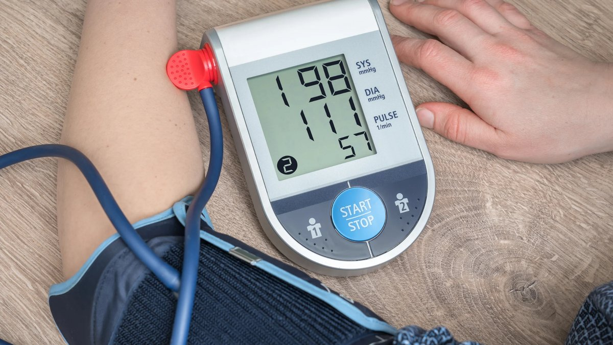
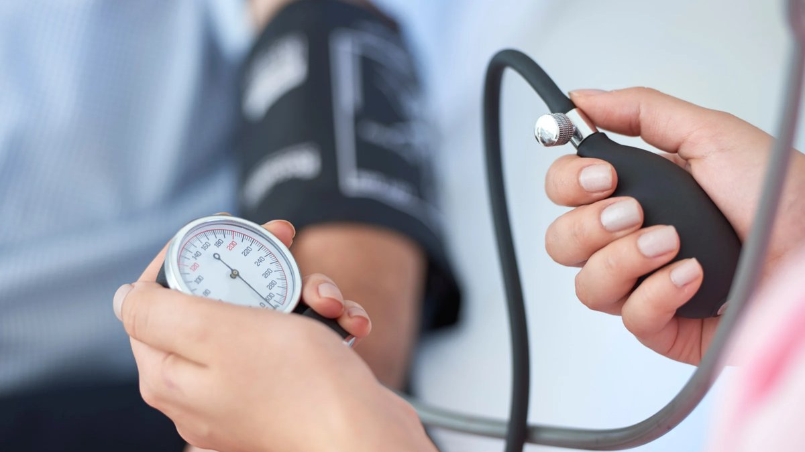

Every time you visit the doctor, someone wraps a cuff around your arm, inflates it, and tells you two numbers. "120 over 80," they might say. But what do these numbers actually mean? And more importantly, why should you care?

Blood pressure is one of the most important indicators of your cardiovascular health. It is more than just a routine measurement, and understanding your numbers could quite literally save your life.

## What Is Blood Pressure?

[Blood pressure is the amount of force your blood uses to get through your arteries.](https://www.heart.org/en/health-topics/high-blood-pressure/the-facts-about-high-blood-pressure) Every time your heart beats, it pumps blood through thousands of miles of blood vessels in your body. The pressure created by this pumping action is what we measure when we check blood pressure.

Systolic blood pressure is the first (top/upper) number. It measures the pressure your blood exerts on the walls of your arteries when the heart beats. Diastolic blood pressure is the second (bottom/lower) number. It measures the pressure your blood exerts on your arterial walls while the heart muscle rests between beats, or while the heart is refilling.

## Understanding the Numbers

Blood pressure readings are written as a ratio, such as 120/80, and measured in millimeters of mercury (mm Hg). Both numbers are important, but they tell different stories about your heart health.

According to the American Heart Association, an ideal blood pressure for most adults means [a systolic pressure of less than 120 and a diastolic pressure of less than 80](https://www.heart.org/en/health-topics/high-blood-pressure/the-facts-about-high-blood-pressure). However, what matters most may depend on your age.

Although both numbers in a blood pressure reading are essential for diagnosing and treating high blood pressure, doctors primarily focus on the top number (systolic pressure), [as a higher number carries a greater risk of heart attack and stroke.](https://www.health.harvard.edu/staying-healthy/which-blood-pressure-number-is-important) However, research shows that in individuals [younger than 50](https://www.heart.org/en/news/2021/03/01/which-blood-pressure-number-matters-most-the-answer-might-depend-on-your-age), diastolic blood pressure may also help in predicting future cardiovascular problems.

## What are the Categories of Blood Pressure?

The [American Heart Association](https://www.heart.org/en/health-topics/high-blood-pressure/the-facts-about-high-blood-pressure) categorizes blood pressure into five main ranges:

- Normal: Less than 120/80 mmHg
- Elevated: Systolic between 120-129 and diastolic less than 80
- High Blood Pressure Stage 1: Systolic between 130-139 or diastolic between 80-89
- High Blood Pressure Stage 2: Systolic 140 or higher or diastolic 90 or higher
- Hypertensive Crisis: Systolic over 180 and/or diastolic over 120 (requires immediate medical attention)

It's important to note that [blood pressure naturally fluctuates throughout the day. ](https://www.health.harvard.edu/staying-healthy/which-blood-pressure-number-is-important)Stress, physical activity, caffeine, and even the time of day can all affect your readings. This is why doctors typically don't diagnose hypertension based on a single elevated reading.

## Why High Blood Pressure is The Silent Killer

Hypertension has earned the nickname "the silent killer" because it often has no symptoms until it causes serious damage. Hypertension affects an estimated [1.3 billion people](https://www.nature.com/articles/s41581-019-0244-2), and is responsible for [7.6 million deaths per annum](https://journals.lww.com/jhypertension/abstract/2011/12001/mortality_patterns_in_hypertension.2.aspx) worldwide.

When blood pressure remains high over time, it forces your heart to work harder than it should and can injure blood vessels. This also puts you at greater risk for heart disease, stroke, and kidney disease. In fact, [around 54% of strokes and 47%](https://journals.lww.com/jhypertension/abstract/2011/12001/mortality_patterns_in_hypertension.2.aspx) of coronary heart disease are attributed to high blood pressure.

## What Causes High Blood Pressure?

For most people, there's no single identifiable cause of high blood pressure; it develops gradually over the years. However, [several risk factors](https://www.webmd.com/hypertension-high-blood-pressure/diastolic-and-systolic-blood-pressure-know-your-numbers) increase your chances of developing it:

- Age
- Family history
- Being overweight or obese
- Physical inactivity
- High sodium intake
- Chronic stress
- Excessive alcohol consumption
- Smoking

## Preventing and Managing High Blood Pressure

Beyond maintaining diet low in sodium, saturated fats, and added sugars, and diets high in fruits and vegetables, whole grains, and lean proteins (fish, poultry, beans, nuts), other [lifestyle modifications](https://www.hopkinsmedicine.org/health/wellness-and-prevention/low-sodium-diet-and-lifestyle-changes-for-high-blood-pressure) are equally important:

- Regular physical activity: Aim for at least 30 minutes of moderate-intensity exercise most days of the week.
- Maintain a healthy weight: Even losing just 5-10 pounds can help lower blood pressure if you're overweight.
- Limit alcohol consumption: If you drink, do so in moderation, no more than one drink per day for women and two for men.
- Manage stress: Chronic stress contributes to high blood pressure. Find healthy ways to cope, such as exercise, meditation, or talking with friends and family.
- Get adequate sleep: Poor sleep quality and insufficient sleep are linked to higher blood pressure. Aim for 7-9 hours of quality sleep each night.
- Monitor your blood pressure regularly: Cqonsider investing in a home blood pressure monitor to track your readings.

## The Bottom Line

Your blood pressure numbers are more than just digits on a screen, they're vital signs that reflect the health of your heart and blood vessels.

Seek immediate medical attention if you experience severe headache, chest pain, shortness of breath, vision changes, and difficulty speaking. These could be signs of a [hypertensive crisis](https://www.ncbi.nlm.nih.gov/books/NBK507701/), a medical emergency requiring immediate treatment.

Remember, high blood pressure is called the "silent killer" for a reason, you won't necessarily feel sick. The only way to know your blood pressure is to measure it. Don't wait until symptoms appear. Take charge of your health today by knowing your numbers and taking steps to keep them in a healthy range.

---

### References

- American Heart Association. (n.d.). Understanding blood pressure readings. Retrieved from https://www.heart.org/en/health-topics/high-blood-pressure/understanding-blood-pressure-readings
- Ahmed, I., Alley, W. D., Chauhan, S., & Afzal, M. (2025, December 1). Hypertensive crisis. StatPearls - NCBI Bookshelf. https://www.ncbi.nlm.nih.gov/books/NBK507701/
- Arima, H., Anderson, C., Omae, T., Woodward, M., MacMahon, S., Mancia, G., ... & Chalmers, J. (2011). Mortality patterns in hypertension. Journal of Hypertension, 29(Suppl 1), S3-S7. https://doi.org/10.1097/01.hjh.0000410246.59221.b1
- Cleveland Clinic. (2025). Blood pressure: Types, ranges & readings. Retrieved from https://www.health.harvard.edu/staying-healthy/which-blood-pressure-number-is-important
- Harvard Health Publishing. (2024). Which blood pressure number is important? Harvard Medical School. Retrieved from https://www.health.harvard.edu/staying-healthy/which-blood-pressure-number-is-important
- Johns Hopkins Medicine. (2025). Low sodium diet and lifestyle changes for high blood pressure. Retrieved from https://www.hopkinsmedicine.org/health/wellness-and-prevention/low-sodium-diet-and-lifestyle-changes-for-high-blood-pressure
- Mills, K. T., Stefanescu, A., & He, J. (2020). The global epidemiology of hypertension. Nature Reviews Nephrology, 16(4), 223-237. https://doi.org/10.1038/s41581-019-0244-2
- Olsen, M. H., Angell, S. Y., Asma, S., Boutouyrie, P., Burger, D., Chirinos, J. A., ... & Schutte, A. E. (2021). Which blood pressure number matters most? The answer might depend on your age. American Heart Association News. Retrieved from https://www.heart.org/en/news/2021/03/01/which-blood-pressure-number-matters-most-the-answer-might-depend-on-your-age
- WebMD. (2025). Diastole vs. systole: Know your blood pressure numbers. Retrieved from https://www.webmd.com/hypertension-high-blood-pressure/diastolic-and-systolic-blood-pressure-know-your-numbers
- World Heart Federation. (2025). Hypertension & heart health. Retrieved from https://world-heart-federation.org/what-we-do/hypertension/