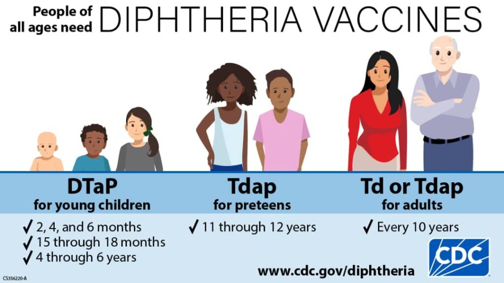

When most people think about vaccination, they think of weeping children on their mothers' arms with candy. Most adults fail to understand the reason behind vaccinations: to strengthen our immune system to fight infections. This principle revolves not only around children; our immunity continues beyond childhood, and so should vaccination. As houses need security from criminals, so does our body from unwanted disease-causing organisms. Vaccines prepare our immune system to recognize specific invaders and prompt a faster response, often stopping the infection before we even fall sick.

### **Why Adult Vaccines Are More Important Than You Realize**

Vaccines serve more purposes than merely preventing childhood diseases. They are necessary throughout all phases of our lives, especially as we get older and our immune systems start to weaken. At this stage, our bodies find it difficult to fight off infections that we could have handled easily in our youth. Our risk of getting infected increases even as the immunity from the vaccines we took in childhood starts to fade, requiring a booster dose or even new vaccines to keep us safe. On top of that, as we evolve in age and our lifestyle changes, we become more exposed either from our work environment or from the things we touch and the people we meet daily.

In addition, we need vaccines to protect ourselves from existing diseases and unexpected outbreaks, as was experienced during the COVID-19 pandemic. During the peak of the pandemic, older people with underlying diseases that threaten their immune system were more predisposed to the COVID-19 virus. Thus, vaccination against existing diseases could build immunity for future outbreaks.

“_The need for vaccination doesn’t end when you become an adult. Immunity from childhood vaccinations can wear off and you may be at risk for new and different diseases_,” reports the [National Foundation for Infectious Diseases](https://www.nfid.org/immunization/us-vaccine-recommendations/adult-immunization-schedule-19-years-and-older/), stressing the need for adult immunization, especially for people above the age of 19.

### **Which Vaccines Do Adults Need? A Simple Guide**

Although there might not be a new pandemic-level outbreak like COVID-19 in some countries and regions, public health officials are actively monitoring current resurgences of certain diseases, thus requiring vaccination for prevention. Among them is the [mpox](https://www.cdc.gov/mpox/about/index.html) outbreak, with cases still reported in Europe, the U.S., and predominantly in Africa. Others include the resurgence of [diphtheria](https://www.cdc.gov/diphtheria/about/index.html) in Africa, with about [43,743 suspected cases](https://www.ncdc.gov.ng/diseases/sitreps/?cat=18&name=An%20Update%20of%20Diphtheria%20Outbreak%20in%20Nigeria) in Nigeria, and rising cases of [pertussis (whooping cough)](https://www.cdc.gov/pertussis/about/index.html) in the U.S., with [more than 10,000 cases](https://www.cdc.gov/pertussis/php/surveillance/index.html) reported each year.

Depending on your age, job, lifestyle, and health condition, several vaccines may be necessary or even overdue:

- [JYNNEOS](https://www.cdc.gov/mpox/vaccines/index.html), a 2-dose vaccine, is available to protect against mpox and smallpox,

- [Tdap](https://www.cdc.gov/diphtheria/vaccines/) vaccine is available, protects against diphtheria, and is taken every ten years,

- the [influenza (Flu) vaccine](https://www.cdc.gov/flu-vaccines-work/benefits/) which is taken annually,

- [shingles vaccine (Shingrix),](https://www.cdc.gov/shingles/vaccines/) recommended for adults older than 50,

- [pneumococcal vaccines](https://www.cdc.gov/pneumococcal/vaccines/), are also important for adults older than 50 and those with chronic conditions.

As reported by the [CDC](https://www.cdc.gov/diphtheria/vaccines/), the letter "T" in Tdap shows that the vaccine also helps protect against tetanus, while the letter "p" shows that it also helps protect against whooping cough (pertussis).

_The CDC clearly illustrates the proposed diphtheria vaccines for people of all ages._ [_Source_](https://www.cdc.gov/diphtheria/vaccines/)

### **Why Do Some Adults Refuse Vaccines? Common Reasons and Myths**

There are several reasons why adults avoid vaccines; most can be attributed to misinformation on social media, where people cast unnecessary doubts over vaccines that are scientifically proven. Religious beliefs or a lack of awareness are major factors in some African countries. Faith in divine protection and healing has led to vaccine objections, especially in rural communities where there is a lack of awareness.  Also, some adults think they are “too old” for vaccines like chickenpox, while others are not informed by their doctors.

### **Adult Vaccination Protects Everyone — Not Just You**

Refusing vaccines could affect everyone around us. Older adults, pregnant women, babies, and those with low immunity rely on the rest of us being vaccinated to help block the spread of serious diseases.

Vaccination is a shared responsibility. Think of it not just as personal protection, but as a plan that benefits the entire community. Every dose you take helps to shield others, from your direct relatives, colleagues, and that stranger at the grocery store.

It is time for us to rewrite the narrative that vaccines are just for kids. Because when adults get vaccinated, everyone benefits.

When was your last vaccine? Talk to your doctor. Check your records. And be part of the solution.
